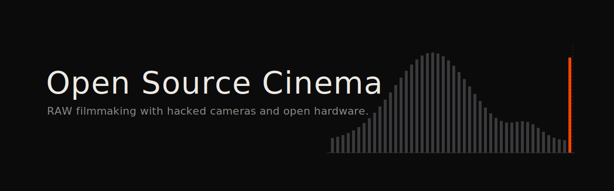

[English](README.md) · **Français**

<div align="center">

# Open Source Cinema

**Cinéma en RAW avec caméras piratées et matériel ouvert.**

[](https://creativecommons.org/licenses/by-nc-nd/4.0/)


</div>

Je suis cinéaste. Je tourne un cinéma d'auteur avec des outils qui n'étaient pas conçus pour ça, ou plutôt, des outils que les fabricants ont *volontairement empêchés* de faire ce que le matériel pouvait déjà faire. Mon film [Maalbeek](https://en.unifrance.org/movie/50347/maalbeek) a remporté le César du Meilleur Court Métrage Documentaire en 2022 et a été présenté en première à la Semaine de la Critique à Cannes. Une partie d'[Ondes Noires](https://en.unifrance.org/movie/45236/dark-waves) a été tournée sur des Canon DSLR en Magic Lantern RAW puis raccordée en postproduction à des images Blackmagic et RED Dragon.

Ce dépôt documente mon approche technique du cinéma indépendant : outils open source, hacks de caméras, workflows RAW, pipelines couleur multi-caméras, et le rôle émergent des agents IA en postproduction.

---

## Table des matières

- [Philosophie](#philosophie)
- [Films](#films)
- [Stack](#stack)
- [Magic Lantern RAW sur Canon 5D Mark III](#magic-lantern-raw-sur-canon-5d-mark-iii)
  - [Pourquoi le RAW sur un DSLR](#pourquoi-le-raw-sur-un-dslr)
  - [Le hack](#le-hack)
  - [Firmwares & builds](#firmwares--builds)
  - [Modes de lecture du capteur](#modes-de-lecture-du-capteur)
  - [Modes de résolution](#modes-de-résolution)
  - [Le mode 3:2](#le-mode-32)
  - [Modes crop & la spéculation 5.7K de Bilal](#modes-crop--la-spéculation-57k-de-bilal)
  - [Stratégie anti-aliasing](#stratégie-anti-aliasing)
  - [Dual ISO : 14 diaphs depuis un DSLR](#dual-iso--14-diaphs-depuis-un-dslr)
  - [Hack d'overclock de carte SD](#hack-doverclock-de-carte-sd)
- [Traitement RAW : MLV App](#traitement-raw--mlv-app)
  - [Algorithmes de dématriçage](#algorithmes-de-dématriçage)
  - [Pipeline de corrections RAW](#pipeline-de-corrections-raw)
  - [Profils & espaces colorimétriques](#profils--espaces-colorimétriques)
  - [Rendu d'affichage AgX](#rendu-daffichage-agx)
  - [Formats d'export](#formats-dexport)
  - [MLV App vs Fast CinemaDNG](#mlv-app-vs-fast-cinemadng)
- [Workflow de postproduction de A à Z](#workflow-de-postproduction-de-a-à-z)
  - [Phase 1 : enregistrement sur le plateau](#phase-1--enregistrement-sur-le-plateau)
  - [Phase 2 : ingest & sauvegarde](#phase-2--ingest--sauvegarde)
  - [Phase 3 : traitement RAW](#phase-3--traitement-raw)
  - [Phase 4 : montage offline](#phase-4--montage-offline)
  - [Phase 5 : conform online](#phase-5--conform-online)
  - [Phase 6 : étalonnage dans DaVinci Resolve](#phase-6--étalonnage-dans-davinci-resolve)
  - [Phase 7 : workflow Final Cut Pro](#phase-7--workflow-final-cut-pro)
  - [Phase 8 : matching multi-caméras](#phase-8--matching-multi-caméras)
  - [Phase 9 : son & livraison DCP](#phase-9--son--livraison-dcp)
- [Ratios d'image & cadrage](#ratios-dimage--cadrage)
- [Matériel](#matériel)
- [Kit caméras : films à venir](#kit-caméras--films-à-venir)
- [Le futur : EOS R & monture RF](#le-futur--eos-r--monture-rf)
- [AXIOM : la caméra de cinéma open source](#axiom--la-caméra-de-cinéma-open-source)
- [Contributions open source](#contributions-open-source)
- [Ressources & liens](#ressources--liens)
- [Activité sur les forums](#activité-sur-les-forums)
- [Archivage numérique : AV1, FFV1 et formats ouverts](#archivage-numérique-av1-ffv1-et-formats-ouverts)

---

## Philosophie

Les caméras de cinéma sont des boîtes noires. Vous payez 20 000 à 80 000 dollars pour une ARRI ou une RED, et vous obtenez un pipeline scellé : leur capteur, leur dématriçage, leur science colorimétrique, leur codec. Vous faites confiance aux ingénieurs pour avoir fait les bons choix. La plupart du temps, c'est le cas.

Mais que se passerait-il si vous pouviez ouvrir la boîte ? Si le DSLR à 1 500 dollars qui traîne dans votre sac avait un capteur capable de RAW 14 bits, 12 à 13 diaphs de plage dynamique, et des résolutions jusqu'à 3,5K, et que le fabricant avait simplement... désactivé tout ça ? Verrouillé derrière un firmware qui ne sort que du H.264 8 bits compressé ?

C'est ce que Magic Lantern a prouvé. Et c'est ce que la caméra AXIOM construit depuis zéro.

Je travaille avec ces outils depuis 2013. J'ai tourné un film césarisé avec ce workflow. J'ai raccordé des images RAW de DSLR Canon avec des caméras de cinéma à 20 000 dollars, et personne dans la salle n'a pu faire la différence.

Ce n'est pas une question d'économie. C'est une question de **contrôle**. Comprendre chaque étape du pipeline image, du photon au pixel. Pouvoir modifier n'importe quel maillon de la chaîne. Ne pas dépendre de la décision d'un fabricant sur ce que vous avez le droit de faire avec du matériel qui vous appartient.

La même logique s'étend au-delà des caméras. Faire tourner des modèles IA en local sur une machine portable plutôt que louer des GPU dans le cloud. Encoder en AV1 et FFV1 plutôt qu'en codecs propriétaires. Archiver en formats ouverts. Mesurer l'empreinte carbone de chaque rendu. Faire tourner Ministral sur un téléphone à 8 Go de RAM. Solaire et petites éoliennes pour le calcul. BitTorrent et pair-à-pair plutôt que des services centralisés.

C'est du **permacomputing** appliqué au cinéma : prolonger la vie du matériel par le logiciel (le 5D Mark III a 13 ans et tourne toujours en RAW à la hauteur de caméras à 20 000 dollars), minimiser l'impact environnemental, décentraliser l'infrastructure, et garder la souveraineté sur ses outils, ses données et son processus créatif. Pas la décentralisation crypto-bro. La liberté artistique par l'indépendance technique.

Ma méthodologie est l'**écriture liquide** : les frontières entre recherche, écriture, tournage et montage se dissolvent. L'écriture se poursuit dans le montage. La recherche contamine la mise en scène. Les accidents algorithmiques deviennent matière filmique. L'IA est un collaborateur qui *altère* la pensée plutôt qu'il ne l'augmente.

---

## Films

### Maalbeek (2020)

**César du Meilleur Court Métrage Documentaire (2022) | Cannes, Semaine de la Critique (2020)**

<div align="center">

[](https://vimeo.com/436720598)

</div>

Le 22 mars 2016, un kamikaze se fait exploser au milieu d'une rame de métro à la station Maalbeek à Bruxelles. Sabine, une jeune femme assise derrière lui, est gravement blessée. Trois mois plus tard, elle se réveille d'un coma sans aucun souvenir de l'explosion. Le film suit sa recherche d'une image manquante, celle d'un événement dont elle n'a aucune mémoire.

Le film utilise de l'animation en nuage de points (photogrammétrie détournée), des images d'archives, des images de vidéosurveillance et des surimpressions pour créer un paysage mental de mémoire fragmentée.

| | |
|---|---|
| **Durée** | 16 min |
| **Format** | HD, Couleur |
| **Production** | Films Grand Huit, Films à Vif |
| **Distribution** | Square Eyes, L'Agence du court métrage |
| **Sélections** | 42 festivals |
| **Prix** | 13+ (César, Prix André-Martin Annecy, Golden Zagreb, Berlin-Brandenburg, Prix Adobe + Prix du Public Clermont-Ferrand, Bayard d'or Namur, et plus) |

Festivals sélectionnés : Cannes (Semaine de la Critique), IDFA, Clermont-Ferrand, Annecy, BFI London, AFI Fest, Palm Springs ShortFest, Animafest Zagreb, Uppsala, interfilm Berlin, Flickerfest, Glasgow, DokuFest.

Candidat au European Film Award (2021).

### Ondes Noires (2017)

**Clermont-Ferrand 2018 | IDFA 2017**

<div align="center">

[](https://www.youtube.com/watch?v=-LZADIJ5jhA)

</div>

Trois personnes incapables de supporter les ondes électromagnétiques racontent ce qu'elles ressentent, comment ça détruit leur vie, et comment elles essaient d'y échapper. Le film matérialise ces ondes invisibles à travers un travail expérimental de l'image.

| | |
|---|---|
| **Durée** | 21 min |
| **Format** | HD 4K, CinemaScope (2.39:1), Dolby 5.1 |
| **Production** | Le Fresnoy, Studio national des arts contemporains |
| **Prix** | Prix Festivals Connexion (Clermont-Ferrand), Grand Prix + Prix de la Jeunesse (Regensburg), Meilleur Documentaire (Chypre), Mention spéciale du jury (Bruxelles) |

Une partie du film a été tournée sur des Canon DSLR en Magic Lantern RAW. Les images ont été raccordées en postproduction avec du matériel Blackmagic et RED Dragon via le pipeline colorimétrique DaVinci Wide Gamut / DaVinci Intermediate décrit plus bas.

---

## Stack

Février 2026. Je travaille sur macOS, Windows et Linux. J'ai construit des Hackintosh pendant des années. Aujourd'hui je me concentre sur des configurations prosumer efficientes en prix pour l'IA locale.

**Cinéma** : Final Cut Pro 12, DaVinci Resolve, MLV App, Magic Lantern, DCP-o-matic, FCPXML, OpenTimelineIO

**Interfaces IA** : [ComfyUI](https://www.comfy.org/), [InvokeAI](https://github.com/invoke-ai/InvokeAI), [Krita AI Diffusion](https://github.com/Acly/krita-ai-diffusion), [SwarmUI](https://github.com/mcmonkeyprojects/SwarmUI), [WanGP](https://github.com/deepbeepmeep/Wan2GP), [Forge Neo](https://github.com/6Morpheus6/forge-neo), Gradio

**Plateformes** : [Glif](https://glif.app/), [Hugging Face](https://huggingface.co/), [Pinokio](https://pinokio.co/)

**Modèles IA** : Wan 2.1/2.2, Flux, SDXL, Hunyuan Video, LTX Video, SAM 3, Depth Anything, RIFE, Real-ESRGAN

**LLM** : GPT, Grok, Mistral, DeepSeek

**3D & moteurs de jeu** : Blender, Unity, Unreal Engine, Godot

**Codecs** : AV1 ([SVT-AV1](https://gitlab.com/AOMediaCodec/SVT-AV1) + [AV1AN](https://github.com/master-of-zen/Av1an)), ProRes, BRAW, Canon RAW Light, FFV1/Matroska, CinemaDNG, DCP (JPEG2000)

**Matériel** :

| Machine | Rôle | Caractéristiques |
|---|---|---|
| **Machine RTX 5090** | IA locale, workflows génératifs | Ryzen 9950X, 96 Go DDR5, format NCASE (tient dans un sac) |
| **MacBook Air M3** | Montage, travail à distance, usage occasionnel | Écran portable pour setup nomade |
| **Comfy Cloud** | GPU de secours | RTX 6000 Pro 96 Go |
| **Mac Studio Ultra M5** *(prévu)* | Serveur IA local décloudifié | Double empilé, 512 Go RAM, IA open source souveraine |

---

## Magic Lantern RAW sur Canon 5D Mark III

### Pourquoi le RAW sur un DSLR

La différence entre le H.264 natif de Canon et le RAW Magic Lantern n'est pas subtile.

| | Canon H.264 | ML RAW (14 bits) | ML RAW + Dual ISO |
|---|---|---|---|
| Profondeur de bits | 8 bits (256 niveaux) | 14 bits (16 384 niveaux) | 14 bits (interpolé) |
| Plage dynamique | ~10-11 diaphs | ~12-13 diaphs | ~14 diaphs |
| Codec | H.264 IPB, avec pertes | Non compressé ou sans perte | Double gain entrelacé |
| Latitude en post | Très limitée (banding à +1,5 IL) | Massive | Comparable à l'ARRI ALEXA |
| Profondeur couleur | 4:2:0 | RGB Bayer complet | RGB Bayer complet |

Poussez un fichier H.264 de 1,5 diaph en post et vous obtenez du banding, des halos autour des hautes lumières, des noirs bouchés. Poussez un fichier RAW 14 bits de 3 diaphs et il tient. L'image a du *corps*. Les transitions entre ombre et lumière sont fluides, pas quantifiées. Ça ressemble à de la pellicule, pas à de la vidéo.

### Le hack

Magic Lantern n'est pas un firmware modifié. C'est un programme indépendant qui tourne en parallèle du firmware Canon, chargé depuis la carte mémoire à chaque démarrage. La seule modification permanente est l'activation du boot depuis la carte (un flag réversible).

Ce que la communauté a accompli par rétro-ingénierie :

- **Enregistrement vidéo RAW** (2013) : découverte que le capteur peut écrire ses données brutes directement sur la carte. Canon avait volontairement désactivé cette fonction.
- **Dual ISO** (2013) : découverte de registres non documentés sur le contrôleur CMOS permettant de programmer deux niveaux d'ISO différents simultanément. C'est une amplification analogique *avant* la conversion A/N.
- **Lecture intégrale du capteur** (2017) : preuve que le capteur du 5D3 peut faire du 4K, voire du 5,7K. Canon limitait la caméra au 1080p H.264.
- **Compression sans perte** : compression JPEG lossless (LJ92) des données RAW, avec une réduction de taille de ~48-58 %. Cela a rendu possible l'enregistrement continu en 3,5K.
- **Overclock de carte SD** : le module `sd_uhs` fait passer le contrôleur SD des 24 MHz conservateurs de Canon à 240 MHz, débloquant jusqu'à 100 Mo/s en écriture.
- **Contournement de la limite des 30 minutes** : suppression de la limitation d'enregistrement imposée pour des raisons de taxation douanière en UE.

Le projet a été initié par [Trammell Hudson](https://trmm.net/Magic_Lantern_firmware/) en 2009. Il a été utilisé sur les sept continents. En 2025, une nouvelle équipe ([names_are_hard](https://www.magiclantern.fm/forum/), [g3gg0](https://www.magiclantern.fm/forum/), [kitor](https://www.magiclantern.fm/forum/index.php?topic=22770.0), WalterSchulz) a relancé le projet, avec un support étendu aux caméras DIGIC 6/7 (200D, 750D, 6D II, 7D II).

### Firmwares & builds

Pour le Canon 5D Mark III, deux versions de firmware sont supportées :

| Firmware | Build | Notes |
|---|---|---|
| **1.1.3** | `crop_rec_4k_mlv_snd_isogain_1x3_presets` | Plus mature, largement testé |
| **1.2.3** | `crop_rec_4k_mlv_snd_isogain_1x3_presets` | Base Canon plus récente, mêmes fonctions ML |

**Build recommandé** : [crop_rec_4k de Danne](https://www.magiclantern.fm/forum/index.php?topic=23041.0) (fil de forum de 51+ pages). C'est le build le plus activement maintenu pour le 5D3, incluant : tous les presets de crop mode, compression sans perte, enregistrement son MLV, contrôle du gain ISO, presets anamorphiques en binning 1x3.

**Dernier fork** (mars 2024) : le [fork d'arnaud-sintes](https://github.com/arnaud-sintes/magiclantern_asintes/releases) ajoute une prévisualisation ultra-rapide, un module de séquençage de mise au point, et l'affichage de l'espace libre double slot en plus du build de Danne.

**GitHub de Danne** : [github.com/dannephoto](https://github.com/dannephoto) (migré depuis Bitbucket après des problèmes de stockage).

**Modules clés à activer :**
- `mlv_rec.mo` ou `mlv_lite.mo` (enregistrement RAW)
- `dual_iso.mo` (Dual ISO)
- `crop_rec.mo` (modes crop et presets)
- `sd_uhs.mo` (overclock carte SD)
- `file_man.mo` (gestionnaire de fichiers)
- `mlv_play.mo` (lecture MLV)
- `mlv_snd.mo` (enregistrement son)

### Modes de lecture du capteur

Comprendre la lecture du capteur est essentiel. Le capteur du 5D Mark III (5760x3840 pixels effectifs) est trop grand pour être lu entièrement aux fréquences vidéo. Le firmware Canon utilise diverses astuces pour réduire les données :

| Mode | Fonctionnement | Qualité | Aliasing |
|---|---|---|---|
| **Line skipping** | Lit une ligne sur 3, jette le reste | Médiocre. Moiré et aliasing sévères | Mauvais |
| **Binning 3x3** | Regroupe des pixels 3x3 et les moyenne | Bon. Couverture plein cadre, résolution réduite | Minimal |
| **Binning 1x3** | Regroupe des pixels 1x3 verticalement | Bon. Étirement anamorphique (désqueeze en post) | Aucun |
| **Crop 1:1 (lecture pixel)** | Lit pixel par pixel une zone recadrée | Excellent. Qualité photo au pixel près | Aucun |

Le mode vidéo 1080p natif de Canon utilise du **line skipping avec un peu de binning** (3x3 avec des trous). Magic Lantern débloque tous les modes de lecture.

Le **binning 3x3** est le point d'équilibre pour la plupart des tournages : il donne une image plein cadre 1920x1080 avec un aliasing minimal, une qualité proche de ce que Canon utilise en interne pour ses meilleurs modes vidéo, mais en sortant du RAW 14 bits au lieu du H.264 compressé.

### Modes de résolution

| Mode | Résolution | Profondeur | Crop | FPS | Continu | Sortie moniteur |
|---|---|---|---|---|---|---|
| **1080p plein cadre** | 1920x1080 | 14 bits sans perte | 1x (binning 3x3) | 23,976/25 | Oui, illimité | **Couleur** en direct |
| **3:2 plein cadre** | 1920x1280 | 14 bits | 1x (binning 3x3) | 24 | Oui | **Couleur** en direct |
| **3,5K Super 35** | 3584x1320 | 10 bits sans perte | ~1,5x | 24/25 | Oui (~90 Mo/s) | Niveaux de gris |
| **1080p48** | 1920x1080 | 14 bits | Binning 3x3 | 45/48 | Oui | Limité |
| **1080p 50/60** | 1920x960/800 | 10-12 bits | Binning 3x3 | 50/60 | Oui | Limité |
| **5,7K anamorphique** | ~5425x2300 (désqueezé) | 10 bits | Binning 1x3 | 24 | Avec card spanning | Cassé |
| **1080p crop 1:1** | 1920x1080 | 10/12 bits | ~2,6x | 50/60 | Oui | **Couleur** (60p) |
| **Capteur complet** | 5760x3840 | 14 bits | Aucun | 7,4 im/s | Rafale | Cassé |

### Le mode 3:2

**Le mode 3:2 (1920x1280) est le mode d'enregistrement continu stable le plus performant du 5D Mark III.**

Pourquoi :
- **Le 3:2 est le ratio natif du capteur.** Aucune donnée n'est perdue au crop.
- **Couverture plein cadre** avec binning 3x3. Aucun facteur de crop.
- **Retour couleur en direct sur le moniteur.** Vous voyez ce que vous filmez en couleur, avec le bon cadrage. La plupart des modes en résolution supérieure forcent le noir et blanc ou un retour cassé.
- **14 bits sans perte.** Plage dynamique maximale.
- **Enregistrement continu sur une seule carte CF.** Pas de perte d'images, pas besoin de card spanning.
- **Sortie HDMI propre** pour moniteurs externes.

Le ratio 3:2 (1,5:1) est peu courant au cinéma mais extrêmement polyvalent en post : crop en 16:9 avec de la marge, en 2.39:1 scope, ou utilisé tel quel pour un cadrage distinctif. Avec un adaptateur anamorphique 1,33x, une image 3:2 se désqueeze en environ 2:1 ou en scope.

**La distinction sur la sortie moniteur compte.** En mode standard 1080p binning 3x3, le retour direct est en couleur complète. Dans les modes crop et les résolutions supérieures, vous perdez la prévisualisation couleur et obtenez soit des niveaux de gris, soit une image cassée/figée. Cela fait des modes 3:2 et 1080p les seuls modes réellement praticables sur le plateau, où vous voyez exactement ce que vous captez.

### Modes crop & la spéculation 5.7K de Bilal

[Bilal (theBilalFakhouri)](https://www.magiclantern.fm/forum/index.php?topic=25784.0) a adapté `crop_rec_4k` pour le 650D/700D, prouvant que ces capteurs d'entrée de gamme pouvaient être poussés vers d'autres modes de lecture au-delà de ce que le `crop_rec` original d'a1ex permettait. Danne a ensuite porté et étendu ça au 5D Mark III.

**Le rêve du 5,7K** : si les techniques `crop_rec` de Bilal étaient pleinement implémentées sur le 5D Mark III avec un retour couleur en direct pendant l'enregistrement, le 5D3 deviendrait la caméra la moins chère au monde à tourner en 5,7K RAW avec :
- Une image à la douceur distinctive, un rendu presque vintage issu du binning 3x3/1x3
- Une plage dynamique 14 bits
- Une couverture plein cadre
- Un monitoring couleur
- Coût total : un boîtier 5D3 d'occasion pour ~600-900 $

Ce n'est pas encore atteint. Les modes 5,7K existent mais avec un retour cassé. Mais le matériel peut le faire. C'est un problème logiciel.

### Stratégie anti-aliasing

**En caméra :**
- **Modes binning 3x3** : binning matériel avant lecture. Aucun aliasing par conception.
- **Modes binning 1x3** : le binning vertical élimine l'aliasing vertical. Désqueeze en post.
- **Mode crop (lecture pixel 1:1)** : lit le capteur pixel par pixel. Pas de line skipping, pas d'aliasing.

**Optique :**
- **Filtre VAF Mosaic Engineering** sur le Canon 7D : filtre passe-bas optique conçu pour la vidéo. Essentiel pour les boîtiers à fort aliasing par line skipping.

**En post (dématriçage MLV App) :**
- **AMaZE** : meilleure qualité globale, sortie la plus nette. Choix principal pour l'export final.
- **IGV** : meilleure gestion du bruit à ISO élevé. Réduit les artefacts colorés dans les ombres.
- **LMMSE** : réduction efficace de l'aliasing à ISO bas.
- **RCD** et **DCB** : alternatives issues de librtprocess (ajoutées dans MLV App v1.13).

### Dual ISO : 14 diaphs depuis un DSLR

C'est le hack le plus impressionnant réalisé par Magic Lantern.

1. Le capteur du 5D3 a une **lecture à 8 canaux**.
2. ML a découvert qu'il pouvait programmer **2 circuits amplificateurs indépendants** à des niveaux d'ISO différents.
3. La moitié des lignes du capteur est lue à **ISO 100** (préservant les hautes lumières), l'autre moitié à **ISO 1600** (récupérant les ombres).
4. L'amplification est **analogique**, avant la conversion A/N. Fondamentalement différent d'un push numérique en post.
5. Les lignes sont entrelacées par paires (0-1 à un ISO, 2-3 à l'autre) pour préserver le motif de Bayer RGGB.
6. Le résultat est fusionné en post pour créer une seule image avec ~14 diaphs de plage dynamique.

Le principe est similaire à celui utilisé par le capteur de l'ARRI ALEXA pour sa plage dynamique : une double lecture combinant ombres et hautes lumières tôt dans le pipeline. Sauf que l'ALEXA coûte plus de 40 000 dollars.

**Compromis** : résolution verticale divisée par deux, moiré accru dans les zones sur/sous-exposées. Pour des scènes à fort contraste (intérieurs en lumière disponible avec fenêtres, extérieurs de nuit), c'est transformateur.

Traitement : **Switch** (anciennement cr2hdr.app) sur macOS, ou le traitement Dual ISO intégré à MLV App.

**Comparaison de plage dynamique** : [Graphiques Dual ISO ML de Photons to Photos](https://www.photonstophotos.net/Charts/PDR_MagicLantern.htm)

### Hack d'overclock de carte SD

Le Canon 5D Mark III a à la fois un slot CF et un slot SD. Canon fait tourner le contrôleur SD à ~24 MHz, de façon conservatrice. Le module `sd_uhs` de Magic Lantern l'overclock pour débloquer le plein potentiel UHS-I.

| Vitesse d'horloge | Vitesse d'écriture | Risque | Notes |
|---|---|---|---|
| **24 MHz** (défaut Canon) | ~20 Mo/s | Aucun | Réglage d'usine |
| **96 MHz** | ~40-45 Mo/s | Faible | Base UHS-I de Canon sur certains modèles |
| **160 MHz** | ~65-70 Mo/s | Faible-moyen | Overclock conservateur |
| **192 MHz** | ~75-85 Mo/s | Moyen | **Maximum recommandé** (dans le spec SDR104) |
| **240 MHz** | ~90-100 Mo/s | Plus élevé | Dépasse le spec UHS-I. Expérimental. |

**Pourquoi c'est important** : avec la CF et la SD overclockée écrivant simultanément (**card spanning**), vous obtenez jusqu'à ~145 Mo/s de bande passante totale. C'est ce qui permet l'enregistrement continu en 3,5K sans perte et les modes en résolution supérieure.

**Cartes recommandées pour 240 MHz :**
- Lexar Professional 1667x (256 Go, 512 Go)
- Lexar Professional Silver Plus R205/W150 (256 Go - 1 To)
- SanDisk Extreme Pro 95 Mo/s
- Samsung EVO Select 2021 (256 Go, 512 Go)

**À éviter** : Kingston Canvas Go! Plus, Samsung EVO Plus 2024, Samsung PRO Ultimate (échec aux tests).

**Réduction du risque** : jusqu'à 192 MHz, c'est techniquement dans les specs UHS-I SDR104. Le contrôleur de la caméra est overclocké, mais la carte fonctionne dans ses propres specs. À 240 MHz, les deux dépassent le spec. Règle de base : **autant que nécessaire, aussi peu que possible.**

Formater les cartes en **ExFAT** (à activer dans le menu ML) pour éviter le découpage des fichiers à 4 Go.

Sources : [Fil overclock SD](https://www.magiclantern.fm/forum/index.php?topic=25841.0) | [Preset 240 MHz](https://www.magiclantern.fm/forum/index.php?topic=26634.0) | [Wiki : cartes compatibles](https://wiki.magiclantern.fm/cards_240mhz) | [Liste de compatibilité memorycard-lab.com](https://www.memorycard-lab.com/-Article/Magic-Lantern-SD-List-RAW-Video)

---

## Traitement RAW : MLV App

[MLV App](https://mlv.app/) ([GitHub](https://github.com/ilia3101/MLV-App)) est l'outil principal pour traiter les fichiers RAW Magic Lantern. Gratuit, open source, activement maintenu. **Support natif Apple Silicon depuis la v1.14.**

### Algorithmes de dématriçage

MLV App propose 9 algorithmes de dématriçage :

| Algorithme | Qualité | Vitesse | Idéal pour |
|---|---|---|---|
| **AMaZE** | Excellente (la plus nette) | Lent | Export final, ISO bas-moyen |
| **IGV** | Très bonne | Moyenne | Images à ISO élevé, récupération des ombres |
| **LMMSE** | Très bonne | Moyenne | ISO bas, anti-aliasing |
| **RCD** | Bonne | Rapide | Usage général (issu de librtprocess) |
| **DCB** | Bonne | Rapide | Usage général (issu de librtprocess) |
| **AHD** | Correcte | Rapide | Prévisualisations rapides |
| **Bilinear** | Basique | Très rapide | Prévisualisations grossières uniquement |
| **Simple** | Minimale | La plus rapide | Visionnage de rushes |
| **None** | N/A | Instantané | Export des données Bayer brutes |

**Pour le cinéma** : AMaZE pour l'export final. IGV pour tout ce qui est tourné au-dessus de ISO 800. LMMSE en cas d'aliasing résiduel issu des modes en line-skipping.

RCD et DCB ont été ajoutés en v1.13 depuis la librairie [librtprocess](https://github.com/CarVac/librtprocess) (aussi utilisée dans darktable et RawTherapee).

### Pipeline de corrections RAW

Appliquez ces corrections **avant** tout étalonnage créatif. Elles corrigent des artefacts au niveau du capteur :

| Correction | Ce qu'elle corrige | Notes |
|---|---|---|
| **Correction des pixels de focus** | Pixels morts/chauds à des positions connues du capteur | Détecte automatiquement le modèle de caméra. Télécharge automatiquement les cartes de pixels de focus. |
| **Correction des pixels défectueux** | Pixels morts/bloqués aléatoires | Interpole depuis les voisins |
| **Lissage chroma** | Bruit couleur, artefacts en labyrinthe dans les ombres | Particulièrement important à ISO élevé et sur les images Dual ISO |
| **Bandes verticales** | Bruit à motif fixe au niveau colonne, issu du circuit de lecture | Le 5D3 en souffre. À toujours activer. |
| **Bruit à motif** | Motifs de bruit répétitifs dans les zones sombres | Soustrait algorithmiquement |
| **Soustraction de trame noire** | Bruit thermique du capteur, amp glow | Nécessite une trame noire filmée bouchon sur l'objectif aux mêmes réglages. Plus efficace pour les longues expositions. |
| **Déflicker** | Variation d'exposition entre images (issue d'éclairage artificiel) | Essentiel sous lumière fluorescente/LED |
| **Traitement Dual ISO** | Fusion de deux niveaux d'ISO en une image HDR | Intégré ou via l'app Switch |

**L'ordre de traitement compte.** MLV App applique les corrections dans le bon ordre en interne : d'abord les pixels défectueux, puis les bandes verticales, le bruit à motif, le lissage chroma, puis le dématriçage.

### Profils & espaces colorimétriques

MLV App v1.14+ inclut 13 profils intégrés pour l'export :

| Profil | Tonemapping | Gamut | Usage |
|---|---|---|---|
| **Standard** | Aucun | Rec.709 | Visionnage rapide |
| **Tonemapped** | Reinhard | Rec.709 | Adoucissement des hautes lumières |
| **Film** | Tangent | Rec.709 | Courbe de réponse type pellicule |
| **Alexa Log-C** | Alexa LogC | ARRI Wide Gamut RGB | Matching avec des caméras ARRI |
| **Cineon Log** | Cineon Log | ARRI Wide Gamut RGB | Workflow de scan pellicule |
| **Sony S-Log 3** | Sony SLog | Sony SGamut3 | Matching avec des caméras Sony |
| **Canon Log** | Canon Log | Canon Cinema Gamut | Matching avec la gamme Canon C |
| **Panasonic V-Log** | Panasonic VLog | Panasonic V-Gamut | Matching avec Panasonic |
| **Fuji F-Log** | Aucun | Rec.2020 | Matching avec Fuji |
| **DaVinci Wide Gamut** | DaVinci Intermediate | DaVinci Wide Gamut | **Recommandé pour workflow Resolve** |
| **Linear** | Aucun | Rec.709 | VFX / compositing |
| **sRGB** | sRGB | Rec.709 | Affichage web |
| **Rec.709** | Rec.709 | Rec.709 | Standard broadcast |

**Pour l'étalonnage dans DaVinci Resolve** : exporter dans le profil **DaVinci Wide Gamut / DaVinci Intermediate** (ou exporter en CinemaDNG sans profil pour une flexibilité maximale).

**Important** : l'export CinemaDNG n'applique que les corrections RAW. Aucun profil, tonemapping ou étalonnage n'est incrusté. C'est voulu. L'export ProRes applique bien le profil sélectionné.

### Rendu d'affichage AgX

MLV App v1.14 a introduit **AgX**, une amélioration majeure pour la reproduction des couleurs saturées. Sous LED RGB, néons, ou toute source lumineuse saturée, le rendu Rec.709 classique écrête les canaux couleur individuellement, créant des virages de teinte disgracieux et des bords durs. AgX utilise une approche plus perceptuellement uniforme qui :

- Préserve la teinte à l'approche de l'écrêtage
- Produit un rolloff plus doux dans les hautes lumières saturées
- Corrige les artefacts cyan dans les hautes lumières (courants avec des balances des blancs sous 4000K)
- Produit globalement un rendu plus agréable, plus filmique, des couleurs extrêmes

À activer via la case AgX dans MLV App.

### Formats d'export

| Format | Codec | Usage |
|---|---|---|
| **CinemaDNG** | Séquence DNG non compressée/compressée | Conform online dans Resolve (données RAW préservées) |
| **ProRes 4444 XQ** | Apple ProRes | Export incrusté qualité maximale |
| **ProRes 4444** | Apple ProRes | Haute qualité avec profil appliqué |
| **ProRes 422 HQ/Standard/LT/Proxy** | Apple ProRes | Fichiers proxy pour montage offline |
| **H.264** | AVC | Prévisualisations grossières |
| **H.265 (10 bits)** | HEVC | Livraison compressée |
| **DNxHR HQX/HQ/SQ/LB** | Avid DNxHR | Workflows Avid |
| **CineForm** | GoPro CineForm 10/12 bits | Codec intermédiaire alternatif |
| **TIFF** | 8/16 bits | Séquences d'images pour le compositing |
| **VP9** | WebM VP9 | Optimisé web (ajouté en v1.14) |

**Assistant de sélection FCPXML** : MLV App peut importer un FCPXML depuis votre montage offline et identifier quels fichiers MLV ont réellement été utilisés. Économise du temps de traitement en n'exportant que les rushes présents dans la timeline.

### MLV App vs Fast CinemaDNG

| | MLV App | Fast CinemaDNG |
|---|---|---|
| **Prix** | Gratuit, open source | Payant (commercial) |
| **Traitement** | Basé CPU | Accéléré GPU (CUDA) |
| **macOS** | Oui (natif Apple Silicon depuis v1.14) | **Non** |
| **Windows** | Oui | Oui |
| **Linux** | Oui | Ubuntu 22.04 (en développement) |
| **GPU requis** | Aucun | **NVIDIA uniquement** (GTX 10xx+) |
| **Lecture** | Prévisualisation avec perte d'images | 4K temps réel sans proxies |
| **Dématriçage** | 9 algorithmes (AMaZE, IGV, LMMSE, RCD, DCB...) | Dématriçage MG |
| **Corrections RAW** | Suite complète (pixels de focus, lissage chroma, bandes verticales, bruit à motif, déflicker, Dual ISO) | Suppression des pixels de focus sur GPU |
| **Étalonnage** | Étalonneur intégré complet (exposition, courbes, teinte/saturation/luminosité, émulation film) | Courbes/niveaux RAW avant dématriçage, LUT 3D |
| **Outils de workflow** | Import FCPXML, gestion de sessions | Traitement par lot |

**En résumé** : sur un Mac Apple Silicon, MLV App est la seule option, et elle est excellente. Fast CinemaDNG est plus rapide mais nécessite un GPU NVIDIA, qu'aucun Mac n'a eu depuis 2019.

Sur une station Windows avec GPU NVIDIA, Fast CinemaDNG est précieux pour traiter par lot de gros volumes ou pour la lecture temps réel sans proxies. Pour tout le reste, MLV App est plus complet.

---

## Workflow de postproduction de A à Z

### Phase 1 : enregistrement sur le plateau

**Configuration caméra :**

| Réglage | Valeur |
|---|---|
| **Modules ML** | `mlv_lite.mo` (vert), `file_man`, `mlv_play`, `mlv_snd`, `crop_rec` |
| **Profondeur de bits** | 14 bits sans perte pour la meilleure qualité ; 10 bits pour le 3,5K |
| **Mode principal** | 1920x1280 (3:2) ou 1920x1080 à 24/25 im/s |
| **ISO** | Rester à ISO 800 ou en dessous |
| **Exposition** | Pousser l'histogramme à droite (ETTR) sans écrêter |
| **Carte CF** | SanDisk Extreme Pro 160 Mo/s ou Lexar Professional 1066x minimum |
| **Système de fichiers** | ExFAT (à activer dans le menu ML pour les fichiers >4 Go) |

**Enregistrement proxy** : le 5D Mark III peut enregistrer un proxy H.264 et le RAW MLV simultanément. Le H.264 sert de support de montage offline. Aucun transcodage nécessaire avant le montage.

**Ne pas appuyer sur le bouton Info pendant l'enregistrement.** Cela peut faire revenir silencieusement la caméra à l'enregistrement H.264. Garder l'overlay ML visible en permanence.

### Phase 2 : ingest & sauvegarde

1. Copier les fichiers MLV + H.264 sur deux disques distincts (sauvegarde 3-2-1 : 3 copies, 2 types de support, 1 hors site)
2. Vérifier que les fichiers MLV se lisent bien dans MLV App avant de formater les cartes
3. Organiser : `NomDuProjet/Jour_XX/Camera_XX/MLV/`
4. Générer des checksums MD5/SHA par fichier pour vérifier l'intégrité des données

### Phase 3 : traitement RAW

Dans MLV App :

1. **Importer** les fichiers MLV
2. **Corrections RAW** (dans l'ordre) : correction des pixels de focus (auto-détection), correction des pixels défectueux, lissage chroma, bandes verticales, bruit à motif
3. Traitement **Dual ISO** si applicable
4. Correction de **balance des blancs** (non destructive en RAW)
5. **Export CinemaDNG** avec la convention de nommage DaVinci Resolve pour le conform online
6. **Export des proxies** en ProRes Proxy ou LT pour le montage offline (si les proxies H.264 de la caméra ne sont pas utilisés)

### Phase 4 : montage offline

Monter avec les fichiers proxy dans le NLE de votre choix :

- **Final Cut Pro** : gestion native du ProRes, export FCPXML vers Resolve
- **DaVinci Resolve** (page Edit) : conform intégré
- **Premiere Pro** : export XML vers Resolve

La timeline est légère. Vous pouvez travailler sur n'importe quelle machine. Exporter en **FCPXML** (Final Cut Pro) ou **XML/AAF** (Premiere/Avid) une fois le montage verrouillé.

### Phase 5 : conform online

Dans DaVinci Resolve :

1. **Importer le XML/FCPXML** depuis le montage offline (page Media ou File > Import > Timeline)
2. **Relinker** les proxies vers les séquences CinemaDNG en pleine résolution. Décocher « Automatically import source clips into media pool » pour forcer le relink vers les originaux.
3. **Vérifier** que chaque coupe, transition et changement de vitesse correspond au montage offline
4. Traiter le travail VFX/Fusion en pleine résolution

### Phase 6 : étalonnage dans DaVinci Resolve

**Réglages de projet pour ML RAW :**

| Réglage | Valeur |
|---|---|
| **Color Science** | DaVinci YRGB (mode CST manuel) |
| **Espace colorimétrique de la timeline** | DaVinci Wide Gamut |
| **Gamma de la timeline** | DaVinci Intermediate |
| **Espace colorimétrique de sortie** | Rec.709 (SDR) ou DCI-P3 (DCP) |

**Onglet Camera RAW** (pour le CinemaDNG) :

| Réglage | Valeur |
|---|---|
| **Decode Using** | Project ou Clip |
| **Espace colorimétrique** | P3 D60 (le plus neutre) ou Rec.709 |
| **Gamma** | BMD Film ou Linear |
| **Récupération des hautes lumières** | Activer (surveiller les artefacts) |

**Note sur le P3 D60** : les tests de la communauté montrent que le P3 D60 produit les teints de peau les plus neutres depuis du CinemaDNG ML. Le Rec.709 peut virer vers le magenta. Le BMD Film peut rendre la peau terne.

**Structure de nœuds (CST Sandwich) :**

```
GROUPE PRE-CLIP (par groupe de caméra) :
  Nœud 1 : [CST] Espace caméra --> DaVinci Wide Gamut / DaVinci Intermediate
          (Tone Mapping : None)

NIVEAU CLIP (clips individuels) :
  Nœud 1 : Corrections primaires (exposition, balance des blancs, contraste)
  Nœud 2 : Étalonnage créatif (look, décisions couleur)
  Nœud 3 : Secondaires (teints de peau, ciel, isolations)
  Nœud 4 : Power windows + tracking si nécessaire
  Nœud 5 : Grain / texture film (optionnel)

NIVEAU TIMELINE (appliqué à tous les clips) :
  Nœud 1 : [CST] DaVinci Wide Gamut / DaVinci Intermediate --> Rec.709 Gamma 2.4
          (Tone Mapping : DaVinci ou Luminance)
```

**Comment configurer les groupes :**
1. Page Color > sélectionner tous les clips d'une caméra
2. Clic droit > « Add into a New Group »
3. Basculer vers le niveau Group Pre-Clip
4. Ajouter le nœud CST d'entrée pour cette caméra
5. Basculer vers le niveau Timeline pour le CST de sortie

**Il n'existe pas d'IDT ACES officiel pour les caméras Canon avec Magic Lantern.** Ne pas essayer de forcer l'ACES. L'approche DaVinci YRGB + CST sandwich donne le même résultat avec plus de contrôle et sans les casse-têtes d'IDT manquants.

### Phase 7 : workflow Final Cut Pro

J'utilise Final Cut Pro pour le montage et le finishing, avec DaVinci Resolve pour l'étalonnage. Le roundtrip :

**De FCP vers Resolve :**
1. Sélectionner le projet dans le Browser FCP
2. File > Export XML (choisir la **version XML 1.9**. Resolve supporte 1.3 à 1.9)
3. Exporter en `.fcpxml` (pas `.fcpxmld`)
4. Dans Resolve : File > Import > Timeline (Maj+Cmd+I)
5. Resolve relink automatiquement les médias. Les fichiers manquants sont signalés en rouge pour relink manuel.

**Ce qui est transféré :** clips compound/multicam, opacité, position, échelle, rotation, animations avec keyframes, timing des clips.

**Ce qui n'est pas transféré :** design et formatage des titres (à reconstruire dans Resolve si besoin).

**De Resolve vers FCP :**
1. Page Deliver > sélectionner le preset d'export « Final Cut Pro »
2. Choisir le codec (ProRes 422 HQ pour le standard, ProRes 4444 pour le HDR)
3. Ajouter à la Render Queue > Render All
4. Dans FCP : File > Import > XML > naviguer vers le XML exporté par Resolve
5. Un nouveau bin et projet sont créés automatiquement avec les clips étalonnés

**Critique** : toujours travailler exclusivement avec la timeline. Le XML référence des positions de timeline, pas l'organisation des bins.

### Phase 8 : matching multi-caméras

Faire correspondre du ML RAW avec des caméras de cinéma dans le même projet. C'est le workflow utilisé sur des productions mixant Canon 5D3 avec Blackmagic, RED Dragon ou ARRI ALEXA.

**Le principe** : convertir toutes les caméras vers le même espace de travail (DaVinci Wide Gamut / DaVinci Intermediate), puis étalonner dans cet espace, puis transformer en sortie vers la livraison.

**Réglages d'entrée CST par caméra :**

| Caméra | Espace colorimétrique d'entrée | Gamma d'entrée | CST vers DWG/DI |
|---|---|---|---|
| **Canon 5D3 ML RAW** | BMD Film ou Rec.709 (depuis l'onglet Camera RAW) | BMD Film ou Linear | Nœud CST : espace d'entrée > DWG/DI |
| **Blackmagic** (BRAW) | DaVinci Wide Gamut | DaVinci Intermediate | Aucun CST nécessaire (décodé directement en DWG/DI dans l'onglet Camera RAW) |
| **RED Dragon** | REDWideGamutRGB | Log3G10 (IPP2) | CST : RWG/Log3G10 > DWG/DI |
| **ARRI ALEXA** | ARRI Wide Gamut 3 | ARRI LogC3 | CST : AWG3/LogC3 > DWG/DI |

**Configuration des groupes dans Resolve :**
```
Groupe A (ML RAW) :     CST Pre-Clip : BMDFilm/Rec.709 --> DWG/DI (Tone Mapping : None)
Groupe B (BRAW) :       Aucun CST nécessaire (décodé en DWG/DI dans l'onglet Camera RAW)
Groupe C (RED R3D) :    CST Pre-Clip : RWG/Log3G10 --> DWG/DI (Tone Mapping : None)
Groupe D (ARRI) :       CST Pre-Clip : AWG3/LogC3 --> DWG/DI (Tone Mapping : None)

Timeline :              CST de sortie : DWG/DI --> Rec.709 Gamma 2.4 (Tone Mapping : DaVinci)
```

Une fois toutes les caméras dans le même espace de travail, l'étalonnage est identique partout. Les teints de peau correspondent, le contraste correspond, le rendu couleur est unifié. C'est ainsi que les images du 5D3 ont été raccordées avec du Blackmagic et du RED Dragon sur Ondes Noires.

### Phase 9 : son & livraison DCP

**Mixage son :**
1. Exporter en AAF/OMF avec des handles depuis Resolve pour le monteur son
2. Mixage professionnel (5.1 ou 7.1 pour le théâtral)
3. Réimporter le mixage final en WAV (48kHz/24 bits minimum) dans Resolve

**Création de DCP (deux approches) :**

**A. DaVinci Resolve Studio** (JPEG2000 accéléré GPU) :
- Page Delivery > preset DCP
- Résolution : 2K Flat (1998x1080) ou 2K Scope (2048x858)
- Cadence : 24 im/s (standard DCI)
- Resolve gère la conversion d'espace colorimétrique vers XYZ Gamma 2.6
- Débit : ~200 Mbit/s (plage 50-250)
- Audio : PCM non compressé 48kHz/24 bits
- Utiliser une convention de nommage conforme ISDCF
- Nécessite une licence Resolve Studio (encodeur Kakadu)

**B. [DCP-o-matic](https://dcpomatic.com/)** (gratuit, open source) :
- Exporter depuis Resolve en séquence TIFF/DPX + WAV, ou en ProRes 4444
- Importer dans DCP-o-matic, configurer résolution/cadence/audio
- Génère un package JPEG2000/MXF
- Utilise OpenJPEG (plus lent que le Kakadu accéléré GPU)
- Excellent pour les sous-titres en packages supplémentaires

**Hybride recommandé** : rendre le DCP depuis Resolve Studio pour la vitesse, utiliser DCP-o-matic pour ajouter des packages de sous-titres ou ajuster les métadonnées.

**Autres livrables :**

| Livrable | Format |
|---|---|
| DCP festival | JPEG2000/MXF, 2K/4K, SMPTE ou InterOp |
| Master broadcast | ProRes 422 HQ, Rec.709, 1080p/UHD |
| Streaming | H.264 ou H.265 selon les specs de la plateforme |
| Master d'archive | ProRes 4444 ou séquence TIFF, espace colorimétrique DWG/DI |

---

## Ratios d'image & cadrage

| Ratio | Usage | Référence |
|---|---|---|
| **1.33:1** (4:3) | Ratio académique. Intime, favorable au portrait. | Philippe Garrel, Xavier Dolan (*Mommy*) |
| **1.5:1** (3:2) | Ratio natif du capteur du 5D3. Options de crop polyvalentes. | |
| **1.66:1** | Écran large européen. Moins agressif que le 1.85. | Standard théâtral européen |
| **1.16:1** | Quasi carré. Expérimental, claustrophobe. | Cinéma d'auteur / expérimental |
| **2.39:1** | Scope anamorphique via binning 1x3 + désqueeze. | Standard CinemaScope |

Des cadremires personnalisés pour ces ratios sont chargés dans Magic Lantern pour le cadrage sur le plateau.

---

## Matériel

<div align="center">


*Canon EOS 5D Mark III. Photo : [decltype](https://en.wikipedia.org/wiki/User:Decltype), CC BY-SA 3.0*

</div>

### Configuration Magic Lantern RAW

| Élément | Rôle | Notes |
|---|---|---|
| **Canon 5D Mark III** | Boîtier cinéma principal | Plein format, RAW 14 bits, Dual ISO, meilleur support ML |
| **Canon 7D** | Secondaire / APS-C | Avec filtre VAF Mosaic Engineering pour l'anti-aliasing |
| **SanDisk Extreme Pro CF** | Support d'enregistrement principal | 160 Mo/s minimum pour l'enregistrement continu |
| **Lexar 1667x SD** | Slot SD overclocké | Pour le card spanning (enregistrement double carte) |
| **Mosaic Engineering VAF** | Filtre passe-bas optique | Essentiel pour la vidéo sur 7D |

---

## Kit caméras : films à venir

Pour mes prochains longs métrages, j'utilise un kit de trois caméras choisi pour ses forces complémentaires selon les situations de tournage. C'est ce que je recommande pour le cinéma indépendant.

<div align="center">

|  |  |  |
|:---:|:---:|:---:|
| **iPhone 15 Pro Max** | **Canon EOS R6 Mark III** | **Blackmagic Pocket Cinema Camera 6K Pro** |

</div>

### Comparaison des caractéristiques

| | iPhone 15 Pro Max | Canon EOS R6 Mark III | BMPCC 6K Pro |
|---|---|---|---|
| **Capteur** | 1/1,28" (48 Mpx principal) | Plein format 32,5 Mpx | Super 35 (21,2 Mpx) |
| **Résolution max** | 4K ProRes | 7K RAW (12 bits) | 6K BRAW (12 bits) |
| **Plage dynamique** | ~12 diaphs (Apple Log) | 15+ diaphs (Canon Log 2) | 13 diaphs |
| **Profil Log** | Apple Log | Canon Log 2 / Canon Log 3 | Blackmagic Film (Gen 5) |
| **Ralenti** | 1080p 240 im/s | 4K 120 im/s (avec audio) | 2,8K 120 im/s |
| **ND intégré** | Non | Non | Oui (2/4/6 stops motorisés) |
| **Stabilisation** | Sensor-shift OIS | 8,5 diaphs | Non |
| **Double ISO natif** | Non | 800 / 6400 | 400 / 3200 |
| **Monture** | Fixe | Canon RF | Canon EF |
| **Prix (boîtier)** | ~1 199 $ (256 Go) | ~2 799 $ | ~2 495 $ |

### Quand j'utilise chaque caméra

**iPhone 15 Pro Max** -- Situations guérilla, discrètes et à l'arraché.

- Travail documentaire où une caméra de cinéma serait intrusive ou impossible
- Making-of, B-roll, images personnelles
- Le ProRes 422 HQ en 10 bits avec Apple Log s'intercoupe avec des caméras de cinéma dans un étalonnage DaVinci Resolve
- Le téléphone disparaît. Les gens oublient qu'ils sont filmés. Ça change ce que vous captez.
- Limite : 4K 30 im/s max pour le ProRes en stockage interne (le 4K 60 im/s nécessite un SSD externe via USB-C)

**Canon EOS R6 Mark III** -- Caméra narrative principale. Le cheval de trait hybride.

- RAW interne 7K (RAW Light Canon 12 bits) avec un 4K suréchantillonné
- Le Canon Log 2 avec le Cinema Gamut donne 15+ diaphs, à la hauteur des caméras Cinema EOS (C50, C80)
- 4K 120 im/s avec audio pour le ralenti
- Double ISO natif 800/6400 pour le travail en lumière disponible
- Écosystème complet de monture RF + adaptateur EF pour les optiques historiques
- Stabilisation à 8,5 diaphs pour le documentaire à l'épaule ou le Steadicam sans Steadicam
- C'est essentiellement une caméra Cinema EOS dans un boîtier hybride à 2 799 $

**Blackmagic Pocket Cinema Camera 6K Pro** -- Environnements contrôlés, interviews, travail en studio.

- Blackmagic RAW 6K en 12 bits, le codec le plus flexible dans cette gamme de prix
- Filtres ND motorisés intégrés (2/4/6 stops) -- pas besoin de kit ND externe
- 13 diaphs de plage dynamique avec la science colorimétrique Gen 5
- Monture EF native : accès à tout l'écosystème d'optiques Canon EF, y compris les optiques cinéma
- Inclut une licence complète DaVinci Resolve Studio (valeur 295 $)
- Écran tactile HDR inclinable de 5" (1500 nits) lisible en extérieur
- Meilleure science colorimétrique au prix. Le look Blackmagic est distinctif et se prête bien à l'étalonnage.

### Pourquoi ces trois-là

Le kit complet coûte moins de 6 500 $ pour trois boîtiers qui couvrent :

- **Discret/guérilla** (iPhone) > **narratif hybride** (R6 III) > **cinéma contrôlé** (BMPCC 6K Pro)
- Les trois tournent en profils log qui peuvent être raccordés dans DaVinci Resolve via le workflow CST sandwich décrit dans ce dépôt
- Le Canon R6 III et le BMPCC 6K Pro partagent l'écosystème d'optiques EF (via adaptateur sur le R6 III), donc les optiques circulent entre les boîtiers
- Chaque caméra sort des images qui s'étalonnent ensemble en DaVinci Wide Gamut / DaVinci Intermediate

### Matching couleur multi-caméras (étendu)

Ajout de ces caméras au workflow CST de la [Phase 8](#phase-8--matching-multi-caméras) :

| Caméra | Espace colorimétrique d'entrée | Gamma d'entrée | CST vers DWG/DI |
|---|---|---|---|
| **iPhone 15 Pro Max** (Apple Log) | Apple Log | Apple Log | CST : Apple Log > DWG/DI |
| **Canon R6 Mark III** (Canon Log 2) | Cinema Gamut | Canon Log 2 | CST : Cinema Gamut/CLog2 > DWG/DI |
| **BMPCC 6K Pro** (BRAW) | DaVinci Wide Gamut | DaVinci Intermediate | Aucun CST nécessaire (décodage direct) |
| **Canon 5D3 ML RAW** (CinemaDNG) | BMD Film / Rec.709 | BMD Film / Linear | CST : BMDFilm > DWG/DI |
| **RED Dragon** (R3D) | REDWideGamutRGB | Log3G10 | CST : RWG/Log3G10 > DWG/DI |
| **ARRI ALEXA** (ARRIRAW/ProRes) | ARRI Wide Gamut 3 | ARRI LogC3 | CST : AWG3/LogC3 > DWG/DI |

Toutes les images convergent vers le même espace de travail. Étalonner une fois, matcher partout.

<div align="center">

*Images : [TheGoldenBox](https://commons.wikimedia.org/wiki/User:TheGoldenBox) CC BY-SA 4.0, [GodeNehler](https://commons.wikimedia.org/wiki/User:GodeNehler) CC BY-SA 4.0, [KKPCW](https://commons.wikimedia.org/wiki/User:KKPCW) CC BY-SA 4.0*

</div>

---

## Le futur : EOS R & monture RF

### Magic Lantern sur DIGIC 8

En février 2024, le développeur **kitor** a réalisé une percée : `mlv_lite` a tourné sur un Canon EOS R et généré un fichier MLV réel. C'est la première fois que l'enregistrement RAW ML fonctionne sur une caméra DIGIC 8.

**Statut actuel :**
- L'enregistrement s'arrête après 60 images (probablement un bug logiciel, pas matériel)
- Interface SD confirmée à 100+ Mo/s en mode SDXC
- Le boot ML complet n'est pas encore atteint (Canon a changé le chiffrement FIR sur le DIGIC 8)
- Pas encore de compression sans perte

**Le blocage principal** : Canon a changé le format de fichier firmware et son chiffrement. La méthode traditionnelle de chargement de code personnalisé via des fichiers firmware modifiés provoque un « green screen hang ». Le développement nécessite soit une nouvelle mise à jour firmware à rétro-analyser, soit d'autres méthodes d'exploitation.

### Pourquoi la monture RF compte

La monture Canon RF a une distance de flange de 20mm. Cela permet d'adapter quasiment n'importe quelle monture d'optique : EF, PL, Leica M/R, Nikon F, Contax/Yashica, M42, optiques cinéma vintage. Les adaptateurs EF électroniques conservent l'autofocus et la stabilisation complets.

Si l'enregistrement RAW ML fonctionne pleinement sur un boîtier EOS R ou RP, vous obtenez :
- Un boîtier mirrorless pour ~500 $ d'occasion
- Un capteur plein format
- Adaptable à n'importe quelle monture d'optique jamais créée
- Enregistrement vidéo RAW
- Dual ISO (potentiellement)
- La caméra RAW plein format la moins chère possible

### La relance de 2025

L'équipe ML a annoncé son intention de :
1. Sortir la **première version ML au-delà du DIGIC 5** (ciblant les caméras DIGIC 6/7 : 200D, 750D, 6D II, 7D II)
2. Affiner la vidéo RAW sur les plateformes existantes
3. Travailler vers un support DIGIC 8 EOS R
4. Le projet a repris le contrôle de ses comptes YouTube et Vimeo

Sources : [PetaPixel](https://petapixel.com/2025/06/22/magic-lantern-software-for-canon-cameras-is-back/) | [4K Shooters](https://www.4kshooters.net/2025/01/02/after-nearly-15-years-in-development-magic-lantern-is-more-alive-than-ever/) | [CineD](https://www.cined.com/magic-lantern-is-back-and-supports-new-cameras-such-as-eos-200d-6d-mark-ii-and-7d-mark-ii/) | [Forum : développement EOS R](https://www.magiclantern.fm/forum/index.php?topic=22770.0)

---

## AXIOM : la caméra de cinéma open source

L'[AXIOM](https://www.apertus.org/) est la première **caméra de cinéma entièrement open source** au monde : matériel ouvert (CERN OHL), logiciel ouvert (GPL v3), documentation ouverte (CC BY-SA). Construite par la communauté [apertus](https://apertus.org/) depuis 2006. Prix Ars Electronica 2012. Financement participatif : 204 568 EUR (175 % de l'objectif).

### Caractéristiques techniques

| Caractéristique | Détails |
|---|---|
| **Capteur** | ams CMV12000, Super 35mm / APS-C |
| **Résolution** | 4096 x 3072 (4K, natif 4:3) |
| **Profondeur de bits** | 12 bits |
| **Obturateur** | **Obturateur global** (pas de rolling shutter) |
| **Cadence max** | 300 im/s (10 bits), 150 im/s (4K pleine résolution) |
| **Plage dynamique** | ~10 diaphs natifs, **jusqu'à 15 diaphs en mode PLR HDR** |
| **Capteur interchangeable** | Physiquement interchangeable |
| **FPGA** | Xilinx Zynq Z-7020 (pipeline image reprogrammable) |
| **Enregistrement** | Externe via USB 3.0 (~400 Mo/s) ou HDMI |
| **Monture d'optique** | Sony E-mount natif, adaptateurs EF/F/MFT |
| **OS** | Linux (Arch Linux), SSH + interface web |
| **Prix** | Developer Kit : 3 990 EUR / Compact : 5 990 EUR |

### Ce que je trouve remarquable

**Le FPGA change tout.** Toute autre caméra utilise un ASIC fixe pour le traitement de l'image. Le FPGA de l'AXIOM est entièrement reprogrammable : algorithme de dématriçage, pipeline de LUT, correction de bruit, conversion d'espace colorimétrique. Vous possédez chaque étape du traitement de l'image.

**Obturateur global à ce prix.** Pas de jello, pas de banding. La plupart des caméras de cinéma en dessous de 10 000 $ ont un rolling shutter.

**Le capteur est interchangeable.** Pas l'optique. Le *capteur*. Vous mettez à jour des modules, pas tout le boîtier.

**150 im/s en 4K.** La plupart des caméras de cinéma limitent à 60 im/s en 4K.

**La connexion Magic Lantern.** A1ex, développeur principal de Magic Lantern, a travaillé sur la science colorimétrique et la caractérisation du capteur de l'AXIOM Beta. Les mêmes personnes qui ont rétro-ingénieré le capteur de Canon construisent une caméra depuis zéro.

### La connexion du pipeline RAW

```
Workflow ML :              Workflow AXIOM :
.MLV --> MLV App           raw12 --> raw2dng
     --> CinemaDNG              --> CinemaDNG
     --> DaVinci Resolve        --> DaVinci Resolve
     --> Étalonnage sur RAW     --> Étalonnage sur RAW
```

Même philosophie : données brutes du capteur, séquences DNG, pleine latitude en post. Les outils sont transférables.

### Évaluation honnête

L'AXIOM Beta n'est pas encore une caméra de cinéma de production. Pas d'enregistrement interne (nécessite un ordinateur externe), pas de codec intégré, pas d'autofocus, pas d'audio intégré, pas de profil caméra dans Resolve. La version Compact (avec boîtier aluminium usiné CNC) est en développement à 5 990 EUR sans date de livraison confirmée.

Mais pour le **travail d'installation, le cinéma expérimental et comme plateforme de développement**, le FPGA programmable ouvre des possibilités qu'aucune autre caméra n'offre. Et si la Compact sort, elle devient une alternative open source légitime à une Blackmagic Pocket 6K : moins bon autofocus (aucun), moins bonne intégration codec, mais obturateur global, capteur interchangeable, pipeline reprogrammable, 150 im/s en 4K, et vous possédez toute la chaîne.

**Dépôts clés :** [axiom-firmware](https://github.com/apertus-open-source-cinema/axiom-firmware) | [nctrl](https://github.com/apertus-open-source-cinema/nctrl) | [axiom-recorder](https://github.com/apertus-open-source-cinema/axiom-recorder) | [dng-rs](https://github.com/apertus-open-source-cinema/dng-rs) | [82 dépôts au total](https://github.com/apertus-open-source-cinema)

---

## Contributions open source

Au-delà de l'usage d'outils open source, j'ai contribué à plusieurs projets de l'écosystème du cinéma open source :

### Magic Lantern & vidéo RAW

- **Encodage CinemaDNG** : contribution à la transition d'un encodage CinemaDNG basé CPU vers un encodage accéléré GPU CUDA, réduisant les temps de conversion par lot de plusieurs heures à quelques minutes sur des images du 5D3 et d'autres caméras ML.
- **[Caméra Apertus / AXIOM](https://apertus.org/)** : participation au développement de l'AXIOM Beta (2013-2015), la première caméra de cinéma entièrement open source au monde. Caractérisation du capteur, tests de workflow, mouvement des caméras de cinéma à matériel ouvert.

### Postproduction & livraison

- **[DCP-o-matic](https://dcpomatic.com/)** : retours d'interface et tests de workflow pour la création de DCP.
- **Archivage FFV1** : plaidoyer pour le codec sans perte FFV1 (standardisé IETF RFC 9043) comme format d'archive ouvert et mathématiquement sans perte pour le cinéma. Le FFV1 en Matroska est désormais accepté par les grandes cinémathèques, dont la Library of Congress et les archives du cinéma autrichien.
- **Encodage AV1** : utilisation de [SVT-AV1](https://gitlab.com/AOMediaCodec/SVT-AV1) + [AV1AN](https://github.com/master-of-zen/Av1an) avec ciblage VMAF pour des encodages de diffusion de qualité cinéma.

### IA & workflows cinéma

- **[ComfyUI Cinema Pipeline](https://github.com/ismael-joffroy-chandoutis/comfyui-cinema-pipeline)** : serveur MCP reliant les workflows génératifs ComfyUI à la postproduction cinéma. Intègre Flux, Wan et Stable Diffusion dans des pipelines compatibles NLE avec une gestion colorimétrique appropriée.

---

## Ressources & liens

### Outils essentiels

| Outil | Lien | Description |
|---|---|---|
| **MLV App** | [mlv.app](https://mlv.app/) / [GitHub](https://github.com/ilia3101/MLV-App) | Traitement MLV principal (gratuit, open source) |
| **Fast CinemaDNG** | [fastcinemadng.com](https://www.fastcinemadng.com/) | Traitement accéléré GPU (NVIDIA, payant) |
| **Switch** | [Forum ML](https://www.magiclantern.fm/forum/index.php?topic=15108) | Traitement Dual ISO pour macOS |
| **MlRawViewer** | [GitHub](https://github.com/ethiccinema/mlrawviewer) | Prévisualisation MLV accélérée GPU |
| **MLVFS** | [Forum ML](https://www.magiclantern.fm/forum/) | Monter du MLV comme un dossier DNG |
| **RAW Calculator** | [rawcalculator.netlify.app](https://rawcalculator.netlify.app/calculator_desktop) | Calcul des paramètres d'enregistrement pour 18 modèles Canon |
| **DaVinci Resolve** | [blackmagicdesign.com](https://www.blackmagicdesign.com/products/davinciresolve) | Étalonnage et livraison |
| **DCP-o-matic** | [dcpomatic.com](https://dcpomatic.com/) | Création de DCP gratuite |
| **OpenTimelineIO** | [GitHub](https://github.com/AcademySoftwareFoundation/OpenTimelineIO) | Échange de timeline open source (ASWF/Pixar, ~1 800 étoiles) |
| **Photon** (Netflix) | [GitHub](https://github.com/Netflix/photon) | Validation de packages IMF |
| **IMFTool** | [GitHub](https://github.com/IMFTool/IMFTool) | Édition CPL et gestion d'assets IMF |

### Téléchargements Magic Lantern

| Ressource | Lien |
|---|---|
| **Builds officiels** | [builds.magiclantern.fm](https://builds.magiclantern.fm/) |
| **Expérimentations 5D3** | [builds.magiclantern.fm/experiments.html](https://builds.magiclantern.fm/experiments.html) |
| **Fil de Danne pour le 5D3** | [Forum : crop_rec_4k 5DIII](https://www.magiclantern.fm/forum/index.php?topic=23041.0) |
| **GitHub de Danne** | [github.com/dannephoto](https://github.com/dannephoto) |
| **Fork arnaud-sintes** | [Releases GitHub](https://github.com/arnaud-sintes/magiclantern_asintes/releases) |

### Tutoriels

- [CineD : RAW sur 5D Mark III avec Magic Lantern](https://www.cined.com/guide-raw-on-a-5d-mark-iii-magic-lantern/) (pas à pas complet)
- [No Film School : workflow offline/online ML RAW](https://nofilmschool.com/2013/09/tutorial-canon-5d-mark-iii-magic-lantern-raw-offline-online)
- [Fstoppers : couleur RAW 3,5K dans DaVinci, montage dans Premiere](https://fstoppers.com/education/shooting-35k-raw-magic-lantern-heres-how-color-davinci-and-edit-premiere-249719)
- [Frame.io : gérer les images RAW avec des nœuds dans Resolve](https://blog.frame.io/2024/06/03/how-to-manage-raw-footage-using-nodes-in-davinci-resolve/)
- [Frame.io : gestion colorimétrique avec les CST dans Resolve](https://blog.frame.io/2024/01/08/color-management-nodes-davinci-resolve/)
- [Larry Jordan : roundtrip FCP et DaVinci Resolve](https://larryjordan.com/articles/round-tripping-projects-between-final-cut-pro-and-davinci-resolve/)

### Plage dynamique & comparaisons

- [Photons to Photos : graphiques de plage dynamique Dual ISO ML](https://www.photonstophotos.net/Charts/PDR_MagicLantern.htm)
- [CineD : 5D3 ML RAW vs Blackmagic Cinema Camera](https://www.cined.com/canon-5d-mark-iii-raw-vs-blackmagic-cinema-camera-raw/)
- [No Film School : 5D3 ML RAW intercoupé avec RED SCARLET](https://nofilmschool.com/2013/07/canon-5d-mark-iii-raw-magic-lantern-red-scarlet-ryan-lightbourn)

### Fils de forum clés

- [crop_rec on steroids : 3K, 4K, 1080p48](https://www.magiclantern.fm/forum/index.php?topic=19300.0) (88 pages)
- [crop_rec_4k de Danne, 5DIII](https://www.magiclantern.fm/forum/index.php?topic=23041.0) (51+ pages)
- [Développement de MLV App](https://www.magiclantern.fm/forum/index.php?topic=20025.0) (200+ pages)
- [Module Dual ISO](https://www.magiclantern.fm/forum/index.php?topic=7139.0)
- [Overclock SD DIGIC 5](https://www.magiclantern.fm/forum/index.php?topic=25841.0)
- [Développement Canon EOS R](https://www.magiclantern.fm/forum/index.php?topic=22770.0)
- [crop_rec_4k de Bilal pour 650D/700D](https://www.magiclantern.fm/forum/index.php?topic=25784.0)

### Documents & dépôts compagnons

| Document | Description |
|---|---|
| **[ML RAW Workflows: DaVinci Resolve & Final Cut Pro](ML-RAW-Workflows-Resolve-FCP.md)** | Guide de workflow pro complet : CinemaDNG dans Resolve, arbres de nœuds CST, matching multi-caméras, livraison DCP/IMF, roundtrip FCP, outils IMF open source |
| **[Agent-Driven Editing: Where Cinema Meets Code](Agent-Driven-Editing-2026.md)** | État de l'art (février 2026) : agents IA pilotant des NLE, serveurs MCP pour Resolve/FCP, OpenTimelineIO, CLI vs GUI, boucle de montage multimodale, automatisation de l'assistant monteur, outils IA pour les mots-clés/collections intelligentes/logging FCP, pipeline agentique complet pour la postproduction de longs métrages |
| **[ComfyUI Cinema Pipeline](https://github.com/ismael-joffroy-chandoutis/comfyui-cinema-pipeline)** | Serveur MCP reliant ComfyUI à la postproduction cinéma : workflows génératifs (Flux, Wan, SD), intégration NLE, spécifications matérielles, gestion colorimétrique |
| **[FCP Workflow](https://github.com/ismael-joffroy-chandoutis/fcp-workflow)** | Stack Final Cut Pro : plugins (CommandPost, BRAW Toolbox, ScriptStar), recherche sémantique FCP 12, serveur MCP FCPXML, workflows de roundtrip, archivage AV1/FFV1 |

---

## Activité sur les forums

Je suis actif sur le [forum Magic Lantern](https://www.magiclantern.fm/forum/) depuis mai 2013 sous le pseudonyme [12georgiadis](https://www.magiclantern.fm/forum/index.php?action=profile;u=24232). 213+ messages sur 25 fils en 9 ans.

### Contributions clés

**Builds expérimentaux & tests :**
- [crop_rec on steroids : 3K, 4K, 1080p48](https://www.magiclantern.fm/forum/index.php?topic=19300.msg206111#msg206111) -- Tests des modes 5,7K, retour direct pendant l'enregistrement
- [crop_rec_4k de Danne, 5DIII](https://www.magiclantern.fm/forum/index.php?topic=23041.msg240658#msg240658) -- Anamorphique 5,7K, exploration de l'overclock SD
- [crop_rec_4k de Danne pour EOS M](https://www.magiclantern.fm/forum/index.php?topic=25781.msg210495#msg210495) -- Workflow crop mode MV1080
- [Caméra de cinéma ML : Dual ISO sans aliasing](https://www.magiclantern.fm/forum/index.php?topic=22818.msg207408#msg207408) -- Tests de qualité Dual ISO
- [Développement RAW 12 bits et 10 bits](https://www.magiclantern.fm/forum/index.php?topic=5601.msg195759#msg195759) -- Tests de profondeur de bits

**Workflow & postproduction :**
- [Développement de MLV App](https://www.magiclantern.fm/forum/index.php?topic=20025.msg205582#msg205582) -- Tests workflow FCPXML, comparaison de dématriçage
- [Relink proxy JPEG vers DNG classique](https://www.magiclantern.fm/forum/index.php?topic=20873.msg195640#msg195640) -- Workflow offline/online
- [Switch (cr2hdr) pour macOS](https://www.magiclantern.fm/forum/index.php?topic=15108.msg206893#msg206893) -- Traitement Dual ISO
- [fastcinemadng](https://www.magiclantern.fm/forum/index.php?topic=19021.msg205684#msg205684) -- Conversion CinemaDNG
- [Réduction de l'aliasing en post avec enfuse/hugin](https://www.magiclantern.fm/forum/index.php?topic=21089.msg193655#msg193655) -- Techniques anti-aliasing

**Cadrage & esthétique cinéma :**
- [Nouveaux cadremires de ratio](https://www.magiclantern.fm/forum/index.php?topic=21439.msg195613#msg195613) -- Ratios 1.33:1, 1.66:1, 1.16:1 (références Garrel, Dolan)

**Tests & comparaisons de caméras :**
- [Images anamorphiques 5,7K du 5D Mark III](https://www.magiclantern.fm/forum/index.php?topic=25180.msg231599#msg231599)
- [GH5 vs 5D Mark III](https://www.magiclantern.fm/forum/index.php?topic=22895.msg206982#msg206982)
- [crop_rec_4k d'ArcziPL pour le 70D](https://www.magiclantern.fm/forum/index.php?topic=25786.msg224059#msg224059) -- Évaluation DPAF
- [Expérimentations de dfort pour le 7D](https://www.magiclantern.fm/forum/index.php?topic=25880.msg195500#msg195500)
- [Silent picture DNG pour le scan pellicule](https://www.magiclantern.fm/forum/index.php?topic=9973.msg96881#msg96881) -- Capture en pleine résolution capteur pour la numérisation de pellicule argentique

---

## Archivage numérique : AV1, FFV1 et formats ouverts

La même logique qui s'applique au piratage de caméras (formats ouverts, contrôle sur tout le pipeline) s'applique à l'archivage. Les codecs propriétaires sont un pari sur la survie et la bonne volonté continues d'une entreprise. Les formats ouverts sont un pari sur un standard.

### Le paysage des codecs

| Format | Type | Usage | Standard |
|--------|------|-----|----------|
| **FFV1** | Sans perte | Archive | IETF RFC 9043 (2021) — éprouvé, approuvé par la Library of Congress |
| **AV1 sans perte** | Sans perte | Archive | SMPTE st2048 — émergent, meilleure compression |
| **AV1 avec pertes** | Avec pertes | Livraison | Netflix, streaming, web |
| **ProRes 422 HQ** | Visuellement sans perte | Intermédiaire | Montage, roundtrip (propriétaire Apple) |
| **CinemaDNG / BRAW** | RAW | Original caméra | Spec ouverte (CinemaDNG) ou propriétaire (BRAW) |

**Originaux caméra → FFV1 ou AV1 sans perte. Livraison → AV1 avec pertes.**

### FFV1 vs AV1 sans perte

| Aspect | FFV1 | AV1 sans perte |
|--------|------|--------------|
| Historique éprouvé | Oui (10+ ans en archives) | Non (mode sans perte vieux d'1 an) |
| Taille de fichier | La plus petite parmi les codecs sans perte | Légèrement plus grande que FFV1 |
| Vitesse d'encodage | Rapide | Plus lente |
| Support des lecteurs | Excellent (VLC, ffmpeg) | Encore inégal |
| Adoption institutionnelle | Library of Congress, INA | Émergente |

**Recommandation** : FFV1 pour les originaux caméra maintenant. AV1 sans perte pour les nouveaux projets où l'on veut des fichiers plus petits et où l'on peut tolérer une maturité d'encodeur moindre.

### Encodeurs matériels AV1

**RTX 5090 (Windows)**
- Triple encodeurs NVENC AV1 de 9e génération
- 60 % plus rapide que la RTX 4090
- Nouveau mode AV1 « Ultra Quality »
- Nécessite le driver NVIDIA 572+

**Apple Silicon M3/M4 (macOS)**
- Décodage matériel AV1 ✓ (rapide)
- Encodage matériel AV1 ✗ — logiciel uniquement (CPU, lent)
- Pour l'encodage AV1 sur Mac : déporter vers une RTX 5090 via Tailscale

### Encodeurs logiciels

**SVT-AV1 3.0** (recommandé)
- Encodeur officiel AOMedia
- **Mode sans perte ajouté en 3.0** (février 2025)
- Traitement parallèle, scalable
- [GitLab : AOMediaCodec/SVT-AV1](https://gitlab.com/AOMediaCodec/SVT-AV1)

**av1an** (wrapper professionnel)
- Détection de scènes, métriques de qualité VMAF, encodage par chunks avec reprise
- Fonctionne avec SVT-AV1, libaom, rav1e
- `pip install av1an`
- [GitHub : master-of-zen/av1an](https://github.com/master-of-zen/av1an)

### Pourquoi Netflix utilise l'AV1

Netflix livre dans 190+ pays. L'AV1 offre :
- 26-31 % de meilleure compression que le H.265 à qualité équivalente
- Gratuit de droits (pas de frais de licence par flux)
- Standard ouvert, décodage matériel sur tous les appareils modernes

**Pour un cinéaste indépendant** : l'AV1 compte pour la livraison (streaming, sortie en ligne). C'est moins urgent que le FFV1 pour l'archivage. Utiliser l'AV1 quand on publie, le FFV1 quand on préserve.

### IMF (Interoperable Master Format)

Pour la livraison à Netflix, Amazon Prime Video, Apple TV+.

L'IMF crée un master unique qui se décline automatiquement selon les territoires (sous-titres, doublages, ratios d'image) sans re-mastering.

**Outils open source :**
- [Netflix/photon](https://github.com/Netflix/photon) — validateur IMF (Java)
- [IMFTool](https://github.com/IMFTool/IMFTool) — éditeur CPL, gestion des versions
- [DSRCorporation/imf-conversion](https://github.com/DSRCorporation/imf-conversion) — utilitaires

**Vérité pour les cinéastes indépendants** : l'IMF est nécessaire pour vendre aux grandes plateformes. La distribution festival/Vimeo/VOD ne l'utilise pas. La mise en place nécessite un outillage séparé de FCP/Resolve (l'export IMF expérimental existe dans Resolve mais n'est pas prêt pour la production).

### Workflow d'archivage (originaux caméra)

```bash
# Étape 1 : convertir le MLV en CinemaDNG (déjà dans le workflow)
# MLV App : export en CinemaDNG sans perte (SlimRAW pour la compression)

# Étape 2 : vérifier & checksum les originaux
md5sum *.DNG > checksums.md5

# Étape 3 : archiver en FFV1 (éprouvé) ou AV1 sans perte (émergent)
# FFV1 via ffmpeg :
ffmpeg -i input.mov -c:v ffv1 -level 3 -coder 1 -context 1 \
       -g 1 -slices 24 -slicecrc 1 archive.mkv

# AV1 sans perte via SVT-AV1 (wrapper av1an) :
av1an -i input.mov -e svt-av1 --lossless 1 -o archive.mkv

# Étape 4 : vérifier l'intégrité
ffmpeg -i archive.mkv -f null - 2>&1 | grep -E "error|warning"

# Étape 5 : conserver les checksums avec l'archive
```

---

## Licence

Cette documentation est publiée sous [CC BY-NC-ND 4.0](https://creativecommons.org/licenses/by-nc-nd/4.0/).

Les outils référencés sont open source sous leurs licences respectives :
- [Magic Lantern](https://www.magiclantern.fm/) -- GPL v2
- [MLV App](https://github.com/ilia3101/MLV-App) -- GPL v3
- [AXIOM / apertus](https://github.com/apertus-open-source-cinema) -- GPL v3 (logiciel), CERN OHL (matériel)

Par [Ismaël Joffroy Chandoutis](https://ismaeljoffroychandoutis.com).
