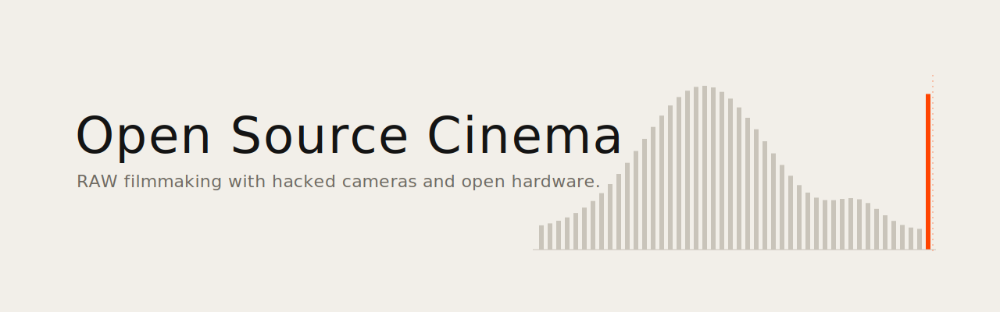
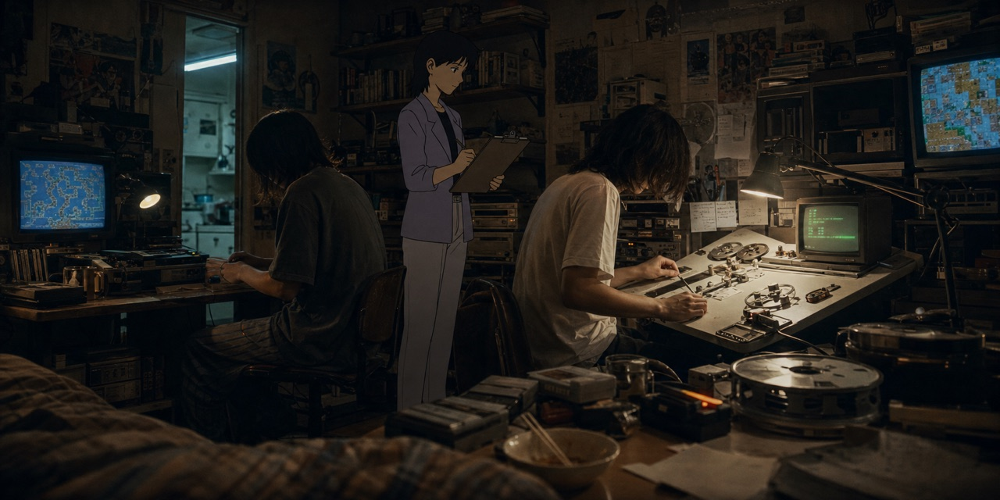

<picture><source media="(prefers-color-scheme: dark)" srcset="banner.svg"></picture>

**English** · [Français](README.fr.md)

<div align="center">

# Open Source Cinema

**RAW video filmmaking with hacked cameras and open hardware.**

[](https://creativecommons.org/licenses/by-nc-nd/4.0/)


</div>

I'm a filmmaker. I shoot auteur cinema with tools that weren't designed for it, or rather, tools that the manufacturers *deliberately prevented* from doing what the hardware could already do. My film [Maalbeek](https://en.unifrance.org/movie/50347/maalbeek) won the César for Best Documentary Short in 2022 and premiered at the Semaine de la Critique in Cannes. Parts of [Ondes Noires](https://en.unifrance.org/movie/45236/dark-waves) were shot on Canon DSLRs with Magic Lantern RAW and matched in post with Blackmagic and RED Dragon footage.

This repo documents my technical approach to independent cinema: open source tools, camera hacks, RAW workflows, multi-camera color pipelines, and the emerging role of AI agents in post-production.



---

## Table of Contents

- [Philosophy](#philosophy)
- [Films](#films)
- [Stack](#stack)
- [Magic Lantern RAW on Canon 5D Mark III](#magic-lantern-raw-on-canon-5d-mark-iii)
  - [Why RAW on a DSLR](#why-raw-on-a-dslr)
  - [The Hack](#the-hack)
  - [Firmware & Builds](#firmware--builds)
  - [Sensor Readout Modes](#sensor-readout-modes)
  - [Resolution Modes](#resolution-modes)
  - [The 3:2 Mode](#the-32-mode)
  - [Crop Modes & Bilal's 5.7K Speculation](#crop-modes--bilals-57k-speculation)
  - [Anti-Aliasing Strategy](#anti-aliasing-strategy)
  - [Dual ISO: 14 Stops from a DSLR](#dual-iso-14-stops-from-a-dslr)
  - [SD Card Overclock Hack](#sd-card-overclock-hack)
- [RAW Processing: MLV App](#raw-processing-mlv-app)
  - [Debayering Algorithms](#debayering-algorithms)
  - [RAW Corrections Pipeline](#raw-corrections-pipeline)
  - [Profiles & Color Spaces](#profiles--color-spaces)
  - [AgX Display Rendering](#agx-display-rendering)
  - [Export Formats](#export-formats)
  - [MLV App vs Fast CinemaDNG](#mlv-app-vs-fast-cinemadng)
- [Post-Production Workflow A to Z](#post-production-workflow-a-to-z)
  - [Phase 1: On-Set Recording](#phase-1-on-set-recording)
  - [Phase 2: Ingest & Backup](#phase-2-ingest--backup)
  - [Phase 3: RAW Processing](#phase-3-raw-processing)
  - [Phase 4: Offline Edit](#phase-4-offline-edit)
  - [Phase 5: Online Conform](#phase-5-online-conform)
  - [Phase 6: Color Grading in DaVinci Resolve](#phase-6-color-grading-in-davinci-resolve)
  - [Phase 7: Final Cut Pro Workflow](#phase-7-final-cut-pro-workflow)
  - [Phase 8: Multi-Camera Matching](#phase-8-multi-camera-matching)
  - [Phase 9: Sound & DCP Delivery](#phase-9-sound--dcp-delivery)
- [Aspect Ratios & Framing](#aspect-ratios--framing)
- [Equipment](#equipment)
- [Camera Kit: Upcoming Films](#camera-kit-upcoming-films)
- [The Future: EOS R & RF Mount](#the-future-eos-r--rf-mount)
- [AXIOM: The Open Source Cinema Camera](#axiom-the-open-source-cinema-camera)
- [Open Source Contributions](#open-source-contributions)
- [Resources & Links](#resources--links)
- [Forum Activity](#forum-activity)
- [Digital Archiving: AV1, FFV1 and Open Formats](#digital-archiving-av1-ffv1-and-open-formats)

---

## Philosophy

Cinema cameras are black boxes. You pay $20,000-$80,000 for an ARRI or a RED, and you get a sealed pipeline: their sensor, their debayering, their color science, their codec. You trust their engineers made the right choices. Most of the time they did.

But what if you could open the box? What if the $1,500 DSLR sitting in your bag had a sensor capable of 14-bit RAW, 12-13 stops of dynamic range, and resolutions up to 3.5K, and the manufacturer just... turned it off? Left it locked behind firmware that only outputs compressed 8-bit H.264?

That's what Magic Lantern proved. And that's what the AXIOM camera is building from scratch.

I've been working with these tools since 2013. I shot a César-winning film with this workflow. I matched Canon DSLR RAW footage with $20,000 cinema cameras and no one in the audience could tell the difference.

This is not about saving money. It's about **control**. Understanding every step of the image pipeline from photon to pixel. Being able to modify any part of the chain. Not depending on a manufacturer's decision about what you're allowed to do with hardware you own.

The same logic extends beyond cameras. Running AI models locally on a portable build instead of renting cloud GPUs. Encoding in AV1 and FFV1 instead of proprietary codecs. Archiving in open formats. Measuring the carbon footprint of every render. Running Ministral on an 8GB phone. Solar and mini wind turbines for compute. BitTorrent and peer-to-peer instead of centralized services.

This is **permacomputing** applied to cinema: extending hardware life through software (the 5D Mark III is 13 years old and still shooting RAW that matches $20K cameras), minimizing environmental impact, decentralizing infrastructure, and maintaining sovereignty over tools, data, and creative process. Not crypto-bro decentralization. Artistic freedom through technical independence.

My methodology is **liquid writing** (*écriture liquide*): the boundaries between research, writing, shooting, and editing dissolve. Writing continues into editing. Research contaminates mise en scène. Algorithmic accidents become filmic material. AI is a collaborator that *alters* thought rather than augmenting it.

---

## Films

### Maalbeek (2020)

**César for Best Documentary Short Film (2022) | Cannes, Semaine de la Critique (2020)**

<div align="center">

[](https://vimeo.com/436720598)

</div>

On March 22, 2016, a suicide bomber detonated himself in the middle car of a subway train at Maalbeek station in Brussels. Sabine, a young woman seated behind him, was seriously injured. Three months later she awoke from a coma remembering nothing of the explosion. The film follows her search for a missing image of an event she has no memory of.

The film uses point cloud animation (diverted photogrammetry), archival footage, CCTV images, and double exposures to create a mental landscape of fragmented memory.

| | |
|---|---|
| **Runtime** | 16 min |
| **Format** | HD, Color |
| **Production** | Films Grand Huit, Films à Vif |
| **Distribution** | Square Eyes, L'Agence du court métrage |
| **Selections** | 42 festivals |
| **Awards** | 13+ (César, Prix André-Martin Annecy, Golden Zagreb, Berlin-Brandenburg, Clermont-Ferrand Adobe Award + Audience Award, Golden Bayard Namur, and more) |

Selected festivals: Cannes (Semaine de la Critique), IDFA, Clermont-Ferrand, Annecy, BFI London, AFI Fest, Palm Springs ShortFest, Animafest Zagreb, Uppsala, interfilm Berlin, Flickerfest, Glasgow, DokuFest.

European Film Award candidate (2021).

### Ondes Noires (Dark Waves, 2017)

**Clermont-Ferrand 2018 | IDFA 2017**

<div align="center">

[](https://www.youtube.com/watch?v=-LZADIJ5jhA)

</div>

Three people unable to tolerate electromagnetic radiation speak about what they feel, how it destroys their lives, and how they try to escape it. The film materializes these invisible waves through experimental image work.

| | |
|---|---|
| **Runtime** | 21 min |
| **Format** | HD 4K, CinemaScope (2.39:1), Dolby 5.1 |
| **Production** | Le Fresnoy, Studio national des arts contemporains |
| **Awards** | Prix Festivals Connexion (Clermont-Ferrand), Grand Prix + Prix de la Jeunesse (Regensburg), Best Documentary (Cyprus), Mention spéciale du jury (Brussels) |

Parts of the film were shot on Canon DSLRs with Magic Lantern RAW. The footage was matched in post-production with Blackmagic and RED Dragon material using the DaVinci Wide Gamut / DaVinci Intermediate color pipeline described below.

---

## Stack

February 2026. I work across macOS, Windows, and Linux. I built Hackintoshes for years. Today I focus on price-efficient prosumer builds for local AI.

**Cinema**: Final Cut Pro 12, DaVinci Resolve, MLV App, Magic Lantern, DCP-o-matic, FCPXML, OpenTimelineIO

**AI Interfaces**: [ComfyUI](https://www.comfy.org/), [InvokeAI](https://github.com/invoke-ai/InvokeAI), [Krita AI Diffusion](https://github.com/Acly/krita-ai-diffusion), [SwarmUI](https://github.com/mcmonkeyprojects/SwarmUI), [WanGP](https://github.com/deepbeepmeep/Wan2GP), [Forge Neo](https://github.com/6Morpheus6/forge-neo), Gradio

**Platforms**: [Glif](https://glif.app/), [Hugging Face](https://huggingface.co/), [Pinokio](https://pinokio.co/)

**AI Models**: Wan 2.1/2.2, Flux, SDXL, Hunyuan Video, LTX Video, SAM 3, Depth Anything, RIFE, Real-ESRGAN

**LLMs**: GPT, Grok, Mistral, DeepSeek

**3D & Game Engines**: Blender, Unity, Unreal Engine, Godot

**Codecs**: AV1 ([SVT-AV1](https://gitlab.com/AOMediaCodec/SVT-AV1) + [AV1AN](https://github.com/master-of-zen/Av1an)), ProRes, BRAW, Canon RAW Light, FFV1/Matroska, CinemaDNG, DCP (JPEG2000)

**Hardware**:

| Machine | Role | Specs |
|---|---|---|
| **RTX 5090 build** | Local AI, generative workflows | Ryzen 9950X, 96GB DDR5, NCASE form factor (fits in a bag) |
| **MacBook Air M3** | Editing, remote work, casual | Portable screen for nomadic setup |
| **Comfy Cloud** | Backup GPU | RTX 6000 Pro 96GB |
| **Mac Studio Ultra M5** *(planned)* | Decloudified local AI server | Dual stacked, 512GB RAM, sovereign open source AI |

---

## Magic Lantern RAW on Canon 5D Mark III

### Why RAW on a DSLR

The difference between Canon's native H.264 and Magic Lantern RAW is not subtle.

| | Canon H.264 | ML RAW (14-bit) | ML RAW + Dual ISO |
|---|---|---|---|
| Bit depth | 8-bit (256 levels) | 14-bit (16,384 levels) | 14-bit (interpolated) |
| Dynamic range | ~10-11 stops | ~12-13 stops | ~14 stops |
| Codec | H.264 IPB, lossy | Uncompressed or lossless | Interlaced dual gain |
| Post latitude | Very limited (banding at +1.5 EV) | Massive | Comparable to ARRI ALEXA |
| Color depth | 4:2:0 | Full RGB Bayer | Full RGB Bayer |

Push an H.264 file 1.5 stops in post and you get banding, halos around highlights, crushed blacks. Push a 14-bit RAW file 3 stops and it holds. The image has *body*. Transitions between shadow and light are smooth, not quantized. It looks like film stock, not video.

### The Hack

Magic Lantern is not a modified firmware. It's an independent program that runs alongside Canon's firmware, loaded from the memory card at each boot. The only permanent change is enabling boot from card (a reversible flag).

What the community achieved through reverse engineering:

- **RAW video recording** (2013): discovered the sensor can write its raw data directly to card. Canon deliberately disabled this.
- **Dual ISO** (2013): found undocumented registers on the CMOS controller chip that allow programming two different ISO levels simultaneously. This is analog amplification *before* A/D conversion.
- **Full sensor readout** (2017): proved the 5D3 sensor can do 4K and even 5.7K. Canon limited the camera to 1080p H.264.
- **Lossless compression**: JPEG lossless (LJ92) compression of RAW data, achieving ~48-58% size reduction. This made continuous 3.5K recording possible.
- **SD card overclocking**: the `sd_uhs` module pushes the SD controller from Canon's conservative 24 MHz up to 240 MHz, unlocking up to 100 MB/s write speeds.
- **30-minute limit bypass**: removed the recording limitation imposed for EU customs taxation reasons.

The project was started by [Trammell Hudson](https://trmm.net/Magic_Lantern_firmware/) in 2009. It has been used on all seven continents. In 2025, a new team ([names_are_hard](https://www.magiclantern.fm/forum/), [g3gg0](https://www.magiclantern.fm/forum/), [kitor](https://www.magiclantern.fm/forum/index.php?topic=22770.0), WalterSchulz) revived the project with support expanding to DIGIC 6/7 cameras (200D, 750D, 6D II, 7D II).

### Firmware & Builds

For the Canon 5D Mark III, two firmware versions are supported:

| Firmware | Build | Notes |
|---|---|---|
| **1.1.3** | `crop_rec_4k_mlv_snd_isogain_1x3_presets` | More mature, widely tested |
| **1.2.3** | `crop_rec_4k_mlv_snd_isogain_1x3_presets` | Newer Canon base, same ML features |

**Recommended build**: [Danne's crop_rec_4k](https://www.magiclantern.fm/forum/index.php?topic=23041.0) (51+ page forum thread). This is the most actively maintained build for the 5D3, including: all crop mode presets, lossless compression, MLV sound recording, ISO gain control, 1x3 binning anamorphic presets.

**Latest fork** (March 2024): [arnaud-sintes' fork](https://github.com/arnaud-sintes/magiclantern_asintes/releases) adds ultrafast framed preview, focus sequencing module, and dual-slot free space display on top of Danne's build.

**Danne's GitHub**: [github.com/dannephoto](https://github.com/dannephoto) (migrated from Bitbucket after storage issues).

**Key modules to activate:**
- `mlv_rec.mo` or `mlv_lite.mo` (RAW recording)
- `dual_iso.mo` (Dual ISO)
- `crop_rec.mo` (crop modes and presets)
- `sd_uhs.mo` (SD card overclock)
- `file_man.mo` (file manager)
- `mlv_play.mo` (MLV playback)
- `mlv_snd.mo` (sound recording)

### Sensor Readout Modes

Understanding sensor readout is essential. The 5D Mark III's sensor (5760x3840 effective pixels) is too large to read entirely at video frame rates. Canon's firmware uses various tricks to reduce the data:

| Mode | How It Works | Quality | Aliasing |
|---|---|---|---|
| **Line skipping** | Reads every 3rd line, discards the rest | Poor. Severe moire and aliasing | Bad |
| **3x3 binning** | Groups 3x3 pixels and averages them | Good. Full-frame coverage, reduced resolution | Minimal |
| **1x3 binning** | Groups 1x3 pixels vertically | Good. Anamorphic stretch (desqueeze in post) | None |
| **1:1 crop (pixel readout)** | Reads pixel-for-pixel from a cropped area | Excellent. Photo-quality per-pixel | None |

Canon's stock 1080p video mode uses **line skipping with some binning** (3x3 with gaps). Magic Lantern unlocks all readout modes.

**3x3 binning** is the sweet spot for most shooting: it gives you a full-frame 1920x1080 image with minimal aliasing, similar quality to what Canon uses internally for its best video modes but now outputting 14-bit RAW instead of compressed H.264.

### Resolution Modes

| Mode | Resolution | Bit Depth | Crop | FPS | Continuous | Monitor Output |
|---|---|---|---|---|---|---|
| **1080p full frame** | 1920x1080 | 14-bit lossless | 1x (3x3 binning) | 23.976/25 | Yes, unlimited | **Color** live view |
| **3:2 full frame** | 1920x1280 | 14-bit | 1x (3x3 binning) | 24 | Yes | **Color** live view |
| **3.5K Super 35** | 3584x1320 | 10-bit lossless | ~1.5x | 24/25 | Yes (~90 MB/s) | Greyscale |
| **1080p48** | 1920x1080 | 14-bit | 3x3 binning | 45/48 | Yes | Limited |
| **1080p 50/60** | 1920x960/800 | 10-12-bit | 3x3 binning | 50/60 | Yes | Limited |
| **5.7K anamorphic** | ~5425x2300 (desqueezed) | 10-bit | 1x3 binning | 24 | With card spanning | Broken |
| **1080p 1:1 crop** | 1920x1080 | 10/12-bit | ~2.6x | 50/60 | Yes | **Color** (60p) |
| **Full sensor** | 5760x3840 | 14-bit | None | 7.4 fps | Burst | Broken |

### The 3:2 Mode

**The 3:2 mode (1920x1280) is the best stable continuous recording mode on the 5D Mark III.**

Why:
- **3:2 is the native sensor aspect ratio.** No data is wasted on cropping.
- **Full-frame coverage** with 3x3 binning. No crop factor.
- **Color live view on the monitor.** You can see what you're shooting in color, with correct framing. Most higher-resolution modes force greyscale or broken previews.
- **14-bit lossless.** Maximum dynamic range.
- **Continuous recording on a single CF card.** No frame drops, no card spanning needed.
- **Clean HDMI output** for external monitors.

The 3:2 aspect ratio (1.5:1) is uncommon in cinema but extremely versatile in post: crop to 16:9 with headroom, to 2.39:1 scope, or use as-is for a distinctive framing. With a 1.33x anamorphic adapter lens, a 3:2 frame desqueezes to approximately 2:1 or scope.

**The monitor output distinction matters.** In the standard 1080p 3x3 binning mode, the live view is full color. In crop modes and higher resolutions, you lose color preview and get either greyscale or a broken/frozen image. This makes the 3:2 and 1080p modes the only truly practical on-set shooting modes where you can see exactly what you're capturing.

### Crop Modes & Bilal's 5.7K Speculation

[Bilal (theBilalFakhouri)](https://www.magiclantern.fm/forum/index.php?topic=25784.0) adapted `crop_rec_4k` for the 650D/700D, proving that these budget sensors could be pushed to use different readout modes beyond what a1ex's original `crop_rec` module achieved. Danne then ported and extended this to the 5D Mark III.

**The 5.7K dream**: If Bilal's `crop_rec` techniques were fully implemented on the 5D Mark III with color live view during recording, the 5D3 would become the cheapest camera in the world shooting 5.7K RAW with:
- An image that has a distinctive softness, almost vintage rendering from the 3x3/1x3 binning
- 14-bit dynamic range
- Full-frame coverage
- Color monitoring
- Total cost: a used 5D3 body for ~$600-900

This hasn't been achieved yet. The 5.7K modes exist but with broken preview. But the hardware can do it. It's a software problem.

### Anti-Aliasing Strategy

**In-camera:**
- **3x3 binning modes**: hardware-level binning before readout. No aliasing by design.
- **1x3 binning modes**: vertical binning eliminates vertical aliasing. Desqueeze in post.
- **Crop mode (1:1 pixel readout)**: reads the sensor pixel-for-pixel. No line skipping, no aliasing.

**Optical:**
- **Mosaic Engineering VAF filter** on the Canon 7D: optical low-pass filter designed for video. Essential for bodies with severe line-skipping aliasing.

**In post (MLV App demosaicing):**
- **AMaZE**: best overall quality, sharpest output. Primary choice for final export.
- **IGV**: better noise handling at high ISO. Reduces color artifacts in shadows.
- **LMMSE**: effective aliasing reduction at low ISO.
- **RCD** and **DCB**: alternatives from librtprocess (added in MLV App v1.13).

### Dual ISO: 14 Stops from a DSLR

This is the most impressive hack Magic Lantern achieved.

1. The 5D3 sensor has an **8-channel readout**.
2. ML discovered it could program **2 independent amplifier circuits** at different ISO levels.
3. Half the sensor lines are read at **ISO 100** (preserving highlights), the other half at **ISO 1600** (recovering shadows).
4. The amplification is **analog**, before A/D conversion. Fundamentally different from digital push in post.
5. Lines are interlaced in pairs (0-1 at one ISO, 2-3 at the other) to maintain the RGGB Bayer pattern.
6. The result is fused in post to create a single image with ~14 stops of dynamic range.

The principle is similar to how the ARRI ALEXA sensor achieves its dynamic range: dual readout combining shadows and highlights early in the pipeline. Except the ALEXA costs $40,000+.

**Trade-offs**: halved vertical resolution, increased moire in over/underexposed zones. For scenes with extreme contrast (available light interiors with windows, night exteriors), it's transformative.

Processing: **Switch** (formerly cr2hdr.app) on macOS, or MLV App's built-in Dual ISO processing.

**Dynamic range comparison**: [Photons to Photos ML Dual ISO charts](https://www.photonstophotos.net/Charts/PDR_MagicLantern.htm)

### SD Card Overclock Hack

The Canon 5D Mark III has both a CF slot and an SD slot. Canon runs the SD controller at a conservative ~24 MHz. Magic Lantern's `sd_uhs` module overclocks it to unlock the full UHS-I potential.

| Clock Speed | Write Speed | Risk | Notes |
|---|---|---|---|
| **24 MHz** (Canon default) | ~20 MB/s | None | Factory setting |
| **96 MHz** | ~40-45 MB/s | Low | Canon's own UHS-I baseline on some models |
| **160 MHz** | ~65-70 MB/s | Low-Medium | Conservative overclock |
| **192 MHz** | ~75-85 MB/s | Medium | **Recommended maximum** (within SDR104 spec) |
| **240 MHz** | ~90-100 MB/s | Higher | Exceeds UHS-I spec. Experimental. |

**Why this matters**: with both CF and overclocked SD writing simultaneously (**card spanning**), you get up to ~145 MB/s total bandwidth. This is what enables continuous 3.5K lossless recording and higher resolution modes.

**Recommended cards for 240 MHz:**
- Lexar Professional 1667x (256 GB, 512 GB)
- Lexar Professional Silver Plus R205/W150 (256 GB - 1 TB)
- SanDisk Extreme Pro 95 MB/s
- Samsung EVO Select 2021 (256 GB, 512 GB)

**Avoid**: Kingston Canvas Go! Plus, Samsung EVO Plus 2024, Samsung PRO Ultimate (failed testing).

**Risk mitigation**: up to 192 MHz is technically within UHS-I SDR104 specifications. The camera controller is overclocked, but the card operates within its own specs. At 240 MHz both are pushed beyond spec. Rule of thumb: **as much as necessary, as little as possible.**

Format cards as **ExFAT** (enable in ML menu) to avoid 4GB file splitting.

Sources: [SD Overclocking thread](https://www.magiclantern.fm/forum/index.php?topic=25841.0) | [240 MHz preset](https://www.magiclantern.fm/forum/index.php?topic=26634.0) | [Wiki: compatible cards](https://wiki.magiclantern.fm/cards_240mhz) | [memorycard-lab.com compatibility list](https://www.memorycard-lab.com/-Article/Magic-Lantern-SD-List-RAW-Video)

---

## RAW Processing: MLV App

[MLV App](https://mlv.app/) ([GitHub](https://github.com/ilia3101/MLV-App)) is the primary tool for processing Magic Lantern RAW files. Free, open source, actively maintained. **Native Apple Silicon support since v1.14.**

### Debayering Algorithms

MLV App offers 9 demosaicing algorithms:

| Algorithm | Quality | Speed | Best For |
|---|---|---|---|
| **AMaZE** | Excellent (sharpest) | Slow | Final export, low-mid ISO |
| **IGV** | Very good | Medium | High ISO footage, shadow recovery |
| **LMMSE** | Very good | Medium | Low ISO, anti-aliasing |
| **RCD** | Good | Fast | General purpose (from librtprocess) |
| **DCB** | Good | Fast | General purpose (from librtprocess) |
| **AHD** | Decent | Fast | Quick previews |
| **Bilinear** | Basic | Very fast | Rough previews only |
| **Simple** | Minimal | Fastest | Scratch viewing |
| **None** | N/A | Instant | Export unprocessed Bayer data |

**For cinema work**: AMaZE for final export. IGV for anything shot above ISO 800. LMMSE if you have residual aliasing from line-skipping modes.

RCD and DCB were added in v1.13 from the [librtprocess](https://github.com/CarVac/librtprocess) library (also used in darktable and RawTherapee).

### RAW Corrections Pipeline

Apply these **before** any creative grading. They fix sensor-level artifacts:

| Correction | What It Fixes | Notes |
|---|---|---|
| **Focus pixel fix** | Dead/hot pixels at known sensor positions | Auto-detects camera model. Downloads focus pixel maps automatically. |
| **Bad pixel fix** | Random dead/stuck pixels | Interpolates from neighbors |
| **Chroma smoothing** | Color noise, maze artifacts in shadows | Especially important on high ISO and Dual ISO footage |
| **Vertical stripes** | Column-level fixed pattern noise from readout circuitry | The 5D3 has this. Always enable. |
| **Pattern noise** | Repeating noise patterns in dark areas | Subtracted algorithmically |
| **Dark frame subtraction** | Sensor thermal noise, amp glow | Requires a dark frame shot with lens cap on at same settings. Most effective for long exposures. |
| **Deflicker** | Exposure variation between frames (from artificial lighting) | Essential under fluorescent/LED lights |
| **Dual ISO processing** | Merging two ISO levels into one HDR frame | Built-in or via Switch app |

**Processing order matters.** MLV App applies corrections in the correct sequence internally: bad pixels first, then vertical stripes, pattern noise, chroma smoothing, then debayering.

### Profiles & Color Spaces

MLV App v1.14+ includes 13 built-in profiles for export:

| Profile | Tonemapping | Gamut | Use Case |
|---|---|---|---|
| **Standard** | None | Rec.709 | Quick viewing |
| **Tonemapped** | Reinhard | Rec.709 | Soft highlight rolloff |
| **Film** | Tangent | Rec.709 | Film-like response curve |
| **Alexa Log-C** | Alexa LogC | ARRI Wide Gamut RGB | Matching ARRI cameras |
| **Cineon Log** | Cineon Log | ARRI Wide Gamut RGB | Film scanning workflow |
| **Sony S-Log 3** | Sony SLog | Sony SGamut3 | Matching Sony cameras |
| **Canon Log** | Canon Log | Canon Cinema Gamut | Matching Canon C-series |
| **Panasonic V-Log** | Panasonic VLog | Panasonic V-Gamut | Matching Panasonic |
| **Fuji F-Log** | None | Rec.2020 | Matching Fuji |
| **DaVinci Wide Gamut** | DaVinci Intermediate | DaVinci Wide Gamut | **Recommended for Resolve workflow** |
| **Linear** | None | Rec.709 | VFX / compositing |
| **sRGB** | sRGB | Rec.709 | Web display |
| **Rec.709** | Rec.709 | Rec.709 | Broadcast standard |

**For DaVinci Resolve grading**: export in **DaVinci Wide Gamut / DaVinci Intermediate** profile (or export CinemaDNG without profile for maximum flexibility).

**Important**: CinemaDNG export only applies RAW corrections. No profile, tonemapping, or grading is baked in. This is by design. ProRes export does apply the selected profile.

### AgX Display Rendering

MLV App v1.14 introduced **AgX**, a major improvement for reproducing saturated colors. Under RGB LEDs, neon lights, or any saturated light source, traditional Rec.709 rendering clips individual color channels, creating ugly hue shifts and hard edges. AgX uses a more perceptually uniform approach that:

- Preserves hue as colors approach clipping
- Produces smoother rolloff in saturated highlights
- Fixes cyan highlight artifacts (common with low white balance temperatures below 4000K)
- Generally produces a more pleasing, film-like rendering of extreme colors

Enable via the AgX checkbox in MLV App.

### Export Formats

| Format | Codec | Use Case |
|---|---|---|
| **CinemaDNG** | Uncompressed/compressed DNG sequence | Online conform in Resolve (RAW data preserved) |
| **ProRes 4444 XQ** | Apple ProRes | Maximum quality baked export |
| **ProRes 4444** | Apple ProRes | High quality with profile applied |
| **ProRes 422 HQ/Standard/LT/Proxy** | Apple ProRes | Proxy files for offline editing |
| **H.264** | AVC | Rough previews |
| **H.265 (10-bit)** | HEVC | Compressed delivery |
| **DNxHR HQX/HQ/SQ/LB** | Avid DNxHR | Avid workflows |
| **CineForm** | GoPro CineForm 10/12-bit | Alternative intermediate codec |
| **TIFF** | 8/16-bit | Frame sequences for compositing |
| **VP9** | WebM VP9 | Web-optimized (added in v1.14) |

**FCPXML Selection Assistant**: MLV App can import an FCPXML from your offline edit and identify which MLV files were actually used. Saves processing time by only exporting the clips in the timeline.

### MLV App vs Fast CinemaDNG

| | MLV App | Fast CinemaDNG |
|---|---|---|
| **Price** | Free, open source | Paid (commercial) |
| **Processing** | CPU-based | GPU-accelerated (CUDA) |
| **macOS** | Yes (native Apple Silicon since v1.14) | **No** |
| **Windows** | Yes | Yes |
| **Linux** | Yes | Ubuntu 22.04 (in dev) |
| **GPU requirement** | None | **NVIDIA only** (GTX 10xx+) |
| **Playback** | Drop-frame preview | Realtime 4K without proxies |
| **Demosaicing** | 9 algorithms (AMaZE, IGV, LMMSE, RCD, DCB...) | MG demosaic |
| **RAW corrections** | Full suite (focus pixels, chroma smoothing, vertical stripes, pattern noise, deflicker, Dual ISO) | Focus pixel suppression on GPU |
| **Color grading** | Full built-in grader (exposure, curves, H-vs-H/S/L, film emulation) | RAW curves/levels before debayer, 3D LUT |
| **Workflow tools** | FCPXML import, session management | Batch processing |

**Bottom line**: if you're on a Mac with Apple Silicon, MLV App is the only option and it's excellent. Fast CinemaDNG is faster but requires an NVIDIA GPU that no Mac has had since 2019.

On a Windows workstation with an NVIDIA GPU, Fast CinemaDNG is valuable for batch processing large volumes or realtime playback without proxies. For everything else, MLV App is more complete.

---

## Post-Production Workflow A to Z

### Phase 1: On-Set Recording

**Camera setup:**

| Setting | Value |
|---|---|
| **ML modules** | `mlv_lite.mo` (green), `file_man`, `mlv_play`, `mlv_snd`, `crop_rec` |
| **Bit depth** | 14-bit lossless for best quality; 10-bit for 3.5K |
| **Primary mode** | 1920x1280 (3:2) or 1920x1080 @ 24/25 fps |
| **ISO** | Stay at or below ISO 800 |
| **Exposure** | Push histogram right (ETTR) without clipping |
| **CF card** | SanDisk Extreme Pro 160 MB/s or Lexar Professional 1066x minimum |
| **File system** | ExFAT (enable in ML menu for files >4 GB) |

**Proxy recording**: the 5D Mark III can record H.264 proxy and MLV RAW simultaneously. The H.264 serves as the offline editing medium. No transcoding needed before editing.

**Do not press the Info button during recording.** It can silently revert the camera to H.264 recording. Keep the ML overlay visible at all times.

### Phase 2: Ingest & Backup

1. Copy MLV + H.264 files to two separate drives (3-2-1 backup: 3 copies, 2 media types, 1 offsite)
2. Verify MLV files play in MLV App before formatting cards
3. Organize: `ProjectName/Day_XX/Camera_XX/MLV/`
4. Generate MD5/SHA checksums per file for data integrity verification

### Phase 3: RAW Processing

In MLV App:

1. **Import** MLV files
2. **RAW corrections** (in order): fix focus pixels (auto-detect), fix bad pixels, chroma smoothing, vertical stripes, pattern noise
3. **Dual ISO** processing if applicable
4. **White balance** correction (non-destructive in RAW)
5. **Export CinemaDNG** with DaVinci Resolve naming convention for online conform
6. **Export proxies** as ProRes Proxy or LT for offline editing (if not using the H.264 proxies from camera)

### Phase 4: Offline Edit

Edit with proxy files in your NLE of choice:

- **Final Cut Pro**: native ProRes handling, FCPXML export for Resolve
- **DaVinci Resolve** (Edit page): integrated conform
- **Premiere Pro**: XML export for Resolve

The timeline is lightweight. You can work on any machine. Export **FCPXML** (Final Cut Pro) or **XML/AAF** (Premiere/Avid) when the cut is locked.

### Phase 5: Online Conform

In DaVinci Resolve:

1. **Import XML/FCPXML** from offline edit (Media page or File > Import > Timeline)
2. **Relink** proxies to full-resolution CinemaDNG sequences. Deselect "Automatically import source clips into media pool" to force relinking to originals.
3. **Verify** every cut, transition, and speed change matches the offline edit
4. Handle VFX/Fusion work at full resolution

### Phase 6: Color Grading in DaVinci Resolve

**Project settings for ML RAW:**

| Setting | Value |
|---|---|
| **Color Science** | DaVinci YRGB (manual CST mode) |
| **Timeline Color Space** | DaVinci Wide Gamut |
| **Timeline Gamma** | DaVinci Intermediate |
| **Output Color Space** | Rec.709 (SDR) or DCI-P3 (DCP) |

**Camera RAW tab** (for CinemaDNG):

| Setting | Value |
|---|---|
| **Decode Using** | Project or Clip |
| **Color Space** | P3 D60 (most neutral) or Rec.709 |
| **Gamma** | BMD Film or Linear |
| **Highlight Recovery** | Enable (watch for artifacts) |

**Note on P3 D60**: community testing shows P3 D60 produces the most neutral skin tones from ML CinemaDNG. Rec.709 can shift skin toward magenta. BMD Film can make skin look muddy.

**Node structure (CST Sandwich):**

```
GROUP PRE-CLIP (per camera group):
  Node 1: [CST] Camera space --> DaVinci Wide Gamut / DaVinci Intermediate
          (Tone Mapping: None)

CLIP LEVEL (individual clips):
  Node 1: Primary corrections (exposure, white balance, contrast)
  Node 2: Creative grade (look, color decisions)
  Node 3: Secondaries (skin tones, sky, isolations)
  Node 4: Power windows + tracking if needed
  Node 5: Film grain / texture (optional)

TIMELINE LEVEL (applied to all clips):
  Node 1: [CST] DaVinci Wide Gamut / DaVinci Intermediate --> Rec.709 Gamma 2.4
          (Tone Mapping: DaVinci or Luminance)
```

**How to set up Groups:**
1. Color page > select all clips from one camera
2. Right-click > "Add into a New Group"
3. Toggle to Group Pre-Clip level
4. Add the input CST node for that camera
5. Toggle to Timeline level for the output CST

**There is no official ACES IDT for Canon cameras with Magic Lantern.** Don't try to force ACES. The DaVinci YRGB + CST sandwich approach gives you the same result with more control and no missing IDT headaches.

### Phase 7: Final Cut Pro Workflow

I use Final Cut Pro for editing and finishing, with DaVinci Resolve for color grading. The round-trip:

**FCP to Resolve:**
1. Select project in FCP Browser
2. File > Export XML (choose **XML version 1.9**. Resolve supports 1.3-1.9)
3. Export as `.fcpxml` (not `.fcpxmld`)
4. In Resolve: File > Import > Timeline (Shift+Cmd+I)
5. Resolve auto-relinks media. Missing files flagged in red for manual relinking.

**What transfers:** compound/multicam clips, opacity, position, scale, rotation, keyframed animations, clip timing.

**What doesn't transfer:** title designs and formatting (rebuild in Resolve if needed).

**Resolve back to FCP:**
1. Deliver page > select "Final Cut Pro" export preset
2. Choose codec (ProRes 422 HQ for standard, ProRes 4444 for HDR)
3. Add to Render Queue > Render All
4. In FCP: File > Import > XML > navigate to Resolve's exported XML
5. New bin and project created automatically with graded clips

**Critical**: always work exclusively with the timeline. The XML references timeline positions, not bin organization.

### Phase 8: Multi-Camera Matching

Matching ML RAW with cinema cameras in the same project. This is the workflow used on productions mixing Canon 5D3 with Blackmagic, RED Dragon, or ARRI ALEXA.

**The principle**: convert all cameras to the same working color space (DaVinci Wide Gamut / DaVinci Intermediate), then grade in that space, then output-transform to delivery.

**Camera-by-camera input CST settings:**

| Camera | Input Color Space | Input Gamma | CST to DWG/DI |
|---|---|---|---|
| **Canon 5D3 ML RAW** | BMD Film or Rec.709 (from Camera RAW tab) | BMD Film or Linear | CST node: input space > DWG/DI |
| **Blackmagic** (BRAW) | DaVinci Wide Gamut | DaVinci Intermediate | No CST needed (decode directly to DWG/DI in Camera RAW tab) |
| **RED Dragon** | REDWideGamutRGB | Log3G10 (IPP2) | CST: RWG/Log3G10 > DWG/DI |
| **ARRI ALEXA** | ARRI Wide Gamut 3 | ARRI LogC3 | CST: AWG3/LogC3 > DWG/DI |

**Group setup in Resolve:**
```
Group A (ML RAW):     Pre-Clip CST: BMDFilm/Rec.709 --> DWG/DI (Tone Mapping: None)
Group B (BRAW):       No CST needed (decoded to DWG/DI in Camera RAW tab)
Group C (RED R3D):    Pre-Clip CST: RWG/Log3G10 --> DWG/DI (Tone Mapping: None)
Group D (ARRI):       Pre-Clip CST: AWG3/LogC3 --> DWG/DI (Tone Mapping: None)

Timeline:             Output CST: DWG/DI --> Rec.709 Gamma 2.4 (Tone Mapping: DaVinci)
```

Once all cameras are in the same working space, grading is identical across the board. Skin tones match, contrast matches, color rendering is unified. This is how the 5D3 footage was matched with Blackmagic and RED Dragon material on Ondes Noires.

### Phase 9: Sound & DCP Delivery

**Sound mix:**
1. Export AAF/OMF with handles from Resolve for the sound editor
2. Professional mix (5.1 or 7.1 for theatrical)
3. Import final mix as WAV (48kHz/24-bit minimum) back into Resolve

**DCP creation (two approaches):**

**A. DaVinci Resolve Studio** (GPU-accelerated JPEG2000):
- Delivery page > DCP preset
- Resolution: 2K Flat (1998x1080) or 2K Scope (2048x858)
- Frame rate: 24 fps (DCI standard)
- Resolve handles color space conversion to XYZ Gamma 2.6
- Bit rate: ~200 Mbit/s (50-250 range)
- Audio: 48kHz/24-bit uncompressed PCM
- Use ISDCF-compliant naming convention
- Requires Resolve Studio license (Kakadu encoder)

**B. [DCP-o-matic](https://dcpomatic.com/)** (free, open source):
- Export from Resolve as TIFF/DPX sequence + WAV, or ProRes 4444
- Import into DCP-o-matic, configure resolution/frame rate/audio
- Generates JPEG2000/MXF package
- Uses OpenJPEG (slower than GPU-accelerated Kakadu)
- Excellent for subtitles as supplemental packages

**Recommended hybrid**: render DCP from Resolve Studio for speed, use DCP-o-matic to add subtitle packages or adjust metadata.

**Other deliverables:**

| Deliverable | Format |
|---|---|
| Festival DCP | JPEG2000/MXF, 2K/4K, SMPTE or InterOp |
| Broadcast master | ProRes 422 HQ, Rec.709, 1080p/UHD |
| Streaming | H.264 or H.265 per platform specs |
| Archive master | ProRes 4444 or TIFF sequence, DWG/DI color space |

---

## Aspect Ratios & Framing

| Ratio | Usage | Reference |
|---|---|---|
| **1.33:1** (4:3) | Academy ratio. Intimate, portrait-friendly. | Philippe Garrel, Xavier Dolan (*Mommy*) |
| **1.5:1** (3:2) | Native sensor ratio of the 5D3. Versatile crop options. | |
| **1.66:1** | European widescreen. Less aggressive than 1.85. | Standard European theatrical |
| **1.16:1** | Near-square. Experimental, claustrophobic. | Auteur / experimental cinema |
| **2.39:1** | Anamorphic scope via 1x3 binning + desqueeze. | CinemaScope standard |

Custom cropmarks for these ratios are loaded into Magic Lantern for on-set framing.

---

## Equipment

<div align="center">


*Canon EOS 5D Mark III. Photo: [decltype](https://en.wikipedia.org/wiki/User:Decltype), CC BY-SA 3.0*

</div>

### Magic Lantern RAW Setup

| Item | Role | Notes |
|---|---|---|
| **Canon 5D Mark III** | Primary cinema body | Full frame, 14-bit RAW, Dual ISO, best ML support |
| **Canon 7D** | Secondary / APS-C | With Mosaic Engineering VAF filter for anti-aliasing |
| **SanDisk Extreme Pro CF** | Primary recording media | 160 MB/s minimum for continuous recording |
| **Lexar 1667x SD** | Overclocked SD slot | For card spanning (dual card recording) |
| **Mosaic Engineering VAF** | Optical low-pass filter | Essential for 7D video |

---

## Camera Kit: Upcoming Films

For my upcoming features, I use a three-camera kit chosen for complementary strengths across different shooting situations. This is what I recommend for indie filmmaking.

<div align="center">

|  |  |  |
|:---:|:---:|:---:|
| **iPhone 15 Pro Max** | **Canon EOS R6 Mark III** | **Blackmagic Pocket Cinema Camera 6K Pro** |

</div>

### Specs Comparison

| | iPhone 15 Pro Max | Canon EOS R6 Mark III | BMPCC 6K Pro |
|---|---|---|---|
| **Sensor** | 1/1.28" (48 MP main) | Full-frame 32.5 MP | Super 35 (21.2 MP) |
| **Max resolution** | 4K ProRes | 7K RAW (12-bit) | 6K BRAW (12-bit) |
| **Dynamic range** | ~12 stops (Apple Log) | 15+ stops (Canon Log 2) | 13 stops |
| **Log profile** | Apple Log | Canon Log 2 / Canon Log 3 | Blackmagic Film (Gen 5) |
| **Slow motion** | 1080p 240 fps | 4K 120 fps (with audio) | 2.8K 120 fps |
| **Built-in ND** | No | No | Yes (2/4/6 stop motorized) |
| **IBIS** | Sensor-shift OIS | 8.5 stops | No |
| **Dual base ISO** | No | 800 / 6400 | 400 / 3200 |
| **Lens mount** | Fixed | Canon RF | Canon EF |
| **Price (body)** | ~$1,199 (256 GB) | ~$2,799 | ~$2,495 |

### When I Use Each Camera

**iPhone 15 Pro Max** -- Guerrilla, discreet, and run-and-gun situations.

- Documentary work where a cinema camera would be intrusive or impossible
- Behind-the-scenes, B-roll, personal footage
- ProRes 422 HQ in 10-bit with Apple Log means it intercuts with cinema cameras in a DaVinci Resolve grade
- The phone disappears. People forget they're being filmed. That changes what you capture.
- Limitation: 4K 30 fps max for ProRes on internal storage (4K 60 fps requires external SSD via USB-C)

**Canon EOS R6 Mark III** -- Primary narrative camera. The hybrid workhorse.

- 7K internal RAW (12-bit Canon RAW Light) with oversampled 4K
- Canon Log 2 with Cinema Gamut gives 15+ stops, matching Cinema EOS cameras (C50, C80)
- 4K 120 fps with audio for slow motion
- Dual base ISO 800/6400 for available light work
- Full RF mount ecosystem + EF adapter for legacy glass
- 8.5-stop IBIS for handheld documentary or Steadicam-free shooting
- This is essentially a Cinema EOS camera in a hybrid body at $2,799

**Blackmagic Pocket Cinema Camera 6K Pro** -- Controlled environments, interviews, studio work.

- 6K Blackmagic RAW at 12-bit, the most flexible codec in this price range
- Built-in motorized ND filters (2/4/6 stop) -- no external ND kit needed
- 13 stops of dynamic range with Gen 5 color science
- Native EF mount: access to the entire Canon EF lens ecosystem, including cinema glass
- Includes a full DaVinci Resolve Studio license ($295 value)
- 5" tilting HDR touchscreen (1500 nits) readable outdoors
- Best color science per dollar. The Blackmagic look is distinctive and grading-friendly.

### Why These Three

The total kit costs under $6,500 for three camera bodies that cover:

- **Discreet/guerrilla** (iPhone) > **hybrid narrative** (R6 III) > **controlled cinema** (BMPCC 6K Pro)
- All three shoot log profiles that can be matched in DaVinci Resolve using the CST sandwich workflow described in this repo
- The Canon R6 III and BMPCC 6K Pro share the EF lens ecosystem (via adapter on R6 III), so lenses move between bodies
- Every camera outputs footage that grades together in DaVinci Wide Gamut / DaVinci Intermediate

### Multi-Camera Color Matching (Extended)

Adding these cameras to the CST workflow from [Phase 8](#phase-8-multi-camera-matching):

| Camera | Input Color Space | Input Gamma | CST to DWG/DI |
|---|---|---|---|
| **iPhone 15 Pro Max** (Apple Log) | Apple Log | Apple Log | CST: Apple Log > DWG/DI |
| **Canon R6 Mark III** (Canon Log 2) | Cinema Gamut | Canon Log 2 | CST: Cinema Gamut/CLog2 > DWG/DI |
| **BMPCC 6K Pro** (BRAW) | DaVinci Wide Gamut | DaVinci Intermediate | No CST needed (decode directly) |
| **Canon 5D3 ML RAW** (CinemaDNG) | BMD Film / Rec.709 | BMD Film / Linear | CST: BMDFilm > DWG/DI |
| **RED Dragon** (R3D) | REDWideGamutRGB | Log3G10 | CST: RWG/Log3G10 > DWG/DI |
| **ARRI ALEXA** (ARRIRAW/ProRes) | ARRI Wide Gamut 3 | ARRI LogC3 | CST: AWG3/LogC3 > DWG/DI |

All footage converges into the same working space. Grade once, match everywhere.

<div align="center">

*Images: [TheGoldenBox](https://commons.wikimedia.org/wiki/User:TheGoldenBox) CC BY-SA 4.0, [GodeNehler](https://commons.wikimedia.org/wiki/User:GodeNehler) CC BY-SA 4.0, [KKPCW](https://commons.wikimedia.org/wiki/User:KKPCW) CC BY-SA 4.0*

</div>

---

## The Future: EOS R & RF Mount

### Magic Lantern on DIGIC 8

In February 2024, developer **kitor** achieved a breakthrough: `mlv_lite` ran on a Canon EOS R and generated an actual MLV file. This is the first time ML RAW recording worked on a DIGIC 8 camera.

**Current status:**
- Recording stops after 60 frames (likely a software bug, not hardware)
- SD interface confirmed at 100+ MB/s in SDXC mode
- Full ML boot not yet achieved (Canon changed FIR encryption on DIGIC 8)
- No lossless compression yet

**The main blocker**: Canon changed the firmware file format and encryption. The traditional method of loading custom code via modified firmware files causes a "green screen hang." Development requires either a new firmware update to reverse-engineer or alternative exploitation methods.

### Why RF Mount Matters

The Canon RF mount has a 20mm flange distance. This means you can adapt virtually any lens mount: EF, PL, Leica M/R, Nikon F, Contax/Yashica, M42, vintage cinema glass. Electronic EF adapters maintain full autofocus and IS.

If ML RAW recording works fully on an EOS R or RP body, you get:
- A mirrorless body for ~$500 used
- Full-frame sensor
- Adapted to any lens mount ever made
- RAW video recording
- Dual ISO (potentially)
- The cheapest full-frame RAW cinema camera possible

### 2025 Revival

The ML team announced plans to:
1. Release the **first ML version beyond DIGIC 5** (targeting DIGIC 6/7 cameras: 200D, 750D, 6D II, 7D II)
2. Refine RAW video on existing platforms
3. Work toward DIGIC 8 EOS R support
4. The project regained control of its YouTube and Vimeo accounts

Sources: [PetaPixel](https://petapixel.com/2025/06/22/magic-lantern-software-for-canon-cameras-is-back/) | [4K Shooters](https://www.4kshooters.net/2025/01/02/after-nearly-15-years-in-development-magic-lantern-is-more-alive-than-ever/) | [CineD](https://www.cined.com/magic-lantern-is-back-and-supports-new-cameras-such-as-eos-200d-6d-mark-ii-and-7d-mark-ii/) | [Forum: EOS R development](https://www.magiclantern.fm/forum/index.php?topic=22770.0)

---

## AXIOM: The Open Source Cinema Camera

The [AXIOM](https://www.apertus.org/) is the world's first **fully open source cinema camera**: open hardware (CERN OHL), open software (GPL v3), open documentation (CC BY-SA). Built by the [apertus](https://apertus.org/) community since 2006. Ars Electronica prize 2012. Crowdfunding: 204,568 EUR (175% of goal).

### Technical Specs

| Spec | Details |
|---|---|
| **Sensor** | ams CMV12000, Super 35mm / APS-C |
| **Resolution** | 4096 x 3072 (4K, native 4:3) |
| **Bit depth** | 12-bit |
| **Shutter** | **Global shutter** (no rolling shutter) |
| **Max framerate** | 300 fps (10-bit), 150 fps (4K full res) |
| **Dynamic range** | ~10 stops native, **up to 15 stops in PLR HDR mode** |
| **Sensor swap** | Physically interchangeable |
| **FPGA** | Xilinx Zynq Z-7020 (reprogrammable image pipeline) |
| **Recording** | External via USB 3.0 (~400 MB/s) or HDMI |
| **Lens mount** | Sony E-mount native, EF/F/MFT adapters |
| **OS** | Linux (Arch Linux), SSH + WebUI |
| **Price** | Developer Kit: 3,990 EUR / Compact: 5,990 EUR |

### What I Find Compelling

**The FPGA changes everything.** Every other camera uses a fixed ASIC for image processing. The AXIOM's FPGA is fully reprogrammable: debayering algorithm, LUT pipeline, noise correction, color space conversion. You own every step of the image processing.

**Global shutter at this price point.** No jello, no banding. Most cinema cameras under $10,000 have rolling shutters.

**The sensor is interchangeable.** Not the lens. The *sensor*. You upgrade modules, not the entire body.

**150 fps at 4K.** Most cinema cameras limit to 60 fps in 4K.

**The Magic Lantern connection.** A1ex, the lead developer of Magic Lantern, worked on the AXIOM Beta's color science and sensor characterization. The same people who reverse-engineered Canon's sensor are building a camera from scratch.

### The RAW Pipeline Connection

```
ML Workflow:              AXIOM Workflow:
.MLV --> MLV App          raw12 --> raw2dng
     --> CinemaDNG             --> CinemaDNG
     --> DaVinci Resolve       --> DaVinci Resolve
     --> Grade on RAW          --> Grade on RAW
```

Same philosophy: raw sensor data, DNG sequences, full latitude in post. The tools are transferable.

### Honest Assessment

The AXIOM Beta is not yet a production cinema camera. No internal recording (requires external computer), no integrated codec, no autofocus, no built-in audio, no camera profile in Resolve. The Compact version (with CNC aluminum body) is in development at 5,990 EUR without a confirmed shipping date.

But for **installation work, experimental cinema, and as a development platform**, the programmable FPGA opens possibilities no other camera offers. And if the Compact ships, it becomes a legitimate open source alternative to a Blackmagic Pocket 6K: worse autofocus (none), worse codec integration, but global shutter, interchangeable sensor, reprogrammable pipeline, 150 fps 4K, and you own the entire stack.

**Key repositories:** [axiom-firmware](https://github.com/apertus-open-source-cinema/axiom-firmware) | [nctrl](https://github.com/apertus-open-source-cinema/nctrl) | [axiom-recorder](https://github.com/apertus-open-source-cinema/axiom-recorder) | [dng-rs](https://github.com/apertus-open-source-cinema/dng-rs) | [82 repos total](https://github.com/apertus-open-source-cinema)

---

## Open Source Contributions

Beyond using open source tools, I've contributed to several projects in the open source cinema ecosystem:

### Magic Lantern & RAW Video

- **CinemaDNG encoding**: Contributed to the transition from CPU-based to CUDA GPU-accelerated CinemaDNG encoding, reducing batch conversion times from hours to minutes on footage from the 5D3 and other ML cameras.
- **[Apertus / AXIOM camera](https://apertus.org/)**: Participated in the development of the AXIOM Beta (2013-2015), the world's first fully open source cinema camera. Sensor characterization, workflow testing, and open hardware cinema camera movement.

### Post-Production & Delivery

- **[DCP-o-matic](https://dcpomatic.com/)**: UI feedback and workflow testing for DCP creation.
- **FFV1 archiving**: Advocacy for the FFV1 lossless codec (standardized as IETF RFC 9043) as an open, mathematically lossless archival format for cinema. FFV1 in Matroska is now accepted by major film archives including the Library of Congress and the Austrian Film Archive.
- **AV1 encoding**: Using [SVT-AV1](https://gitlab.com/AOMediaCodec/SVT-AV1) + [AV1AN](https://github.com/master-of-zen/Av1an) with VMAF targeting for cinema-quality distribution encodes.

### AI & Cinema Workflows

- **[ComfyUI Cinema Pipeline](https://github.com/ismael-joffroy-chandoutis/comfyui-cinema-pipeline)**: MCP server bridging ComfyUI generative workflows with cinema post-production. Integrates Flux, Wan, and Stable Diffusion into NLE-compatible pipelines with proper color management.

---

## Resources & Links

### Essential Tools

| Tool | Link | Description |
|---|---|---|
| **MLV App** | [mlv.app](https://mlv.app/) / [GitHub](https://github.com/ilia3101/MLV-App) | Primary MLV processing (free, open source) |
| **Fast CinemaDNG** | [fastcinemadng.com](https://www.fastcinemadng.com/) | GPU-accelerated processing (NVIDIA, paid) |
| **Switch** | [ML Forum](https://www.magiclantern.fm/forum/index.php?topic=15108) | Dual ISO processing for macOS |
| **MlRawViewer** | [GitHub](https://github.com/ethiccinema/mlrawviewer) | GPU-accelerated MLV preview |
| **MLVFS** | [ML Forum](https://www.magiclantern.fm/forum/) | Mount MLV as DNG folder |
| **RAW Calculator** | [rawcalculator.netlify.app](https://rawcalculator.netlify.app/calculator_desktop) | Calculate recording params for 18 Canon models |
| **DaVinci Resolve** | [blackmagicdesign.com](https://www.blackmagicdesign.com/products/davinciresolve) | Color grading and delivery |
| **DCP-o-matic** | [dcpomatic.com](https://dcpomatic.com/) | Free DCP creation |
| **OpenTimelineIO** | [GitHub](https://github.com/AcademySoftwareFoundation/OpenTimelineIO) | Open source timeline interchange (ASWF/Pixar, ~1,800 stars) |
| **Photon** (Netflix) | [GitHub](https://github.com/Netflix/photon) | IMF package validation |
| **IMFTool** | [GitHub](https://github.com/IMFTool/IMFTool) | IMF CPL editing and asset management |

### Magic Lantern Downloads

| Resource | Link |
|---|---|
| **Official builds** | [builds.magiclantern.fm](https://builds.magiclantern.fm/) |
| **5D3 experiments** | [builds.magiclantern.fm/experiments.html](https://builds.magiclantern.fm/experiments.html) |
| **Danne's 5D3 thread** | [Forum: crop_rec_4k 5DIII](https://www.magiclantern.fm/forum/index.php?topic=23041.0) |
| **Danne's GitHub** | [github.com/dannephoto](https://github.com/dannephoto) |
| **arnaud-sintes fork** | [GitHub releases](https://github.com/arnaud-sintes/magiclantern_asintes/releases) |

### Tutorials

- [CineD: RAW on 5D Mark III with Magic Lantern](https://www.cined.com/guide-raw-on-a-5d-mark-iii-magic-lantern/) (complete step-by-step)
- [No Film School: ML RAW Offline/Online Workflow](https://nofilmschool.com/2013/09/tutorial-canon-5d-mark-iii-magic-lantern-raw-offline-online)
- [Fstoppers: 3.5K RAW Color in DaVinci, Edit in Premiere](https://fstoppers.com/education/shooting-35k-raw-magic-lantern-heres-how-color-davinci-and-edit-premiere-249719)
- [Frame.io: Managing RAW Footage with Nodes in Resolve](https://blog.frame.io/2024/06/03/how-to-manage-raw-footage-using-nodes-in-davinci-resolve/)
- [Frame.io: Color Management with CSTs in Resolve](https://blog.frame.io/2024/01/08/color-management-nodes-davinci-resolve/)
- [Larry Jordan: Round-Tripping FCP and DaVinci Resolve](https://larryjordan.com/articles/round-tripping-projects-between-final-cut-pro-and-davinci-resolve/)

### Dynamic Range & Comparisons

- [Photons to Photos: ML Dual ISO DR Charts](https://www.photonstophotos.net/Charts/PDR_MagicLantern.htm)
- [CineD: 5D3 ML RAW vs Blackmagic Cinema Camera](https://www.cined.com/canon-5d-mark-iii-raw-vs-blackmagic-cinema-camera-raw/)
- [No Film School: 5D3 ML RAW intercut with RED SCARLET](https://nofilmschool.com/2013/07/canon-5d-mark-iii-raw-magic-lantern-red-scarlet-ryan-lightbourn)

### Key Forum Threads

- [crop_rec on steroids: 3K, 4K, 1080p48](https://www.magiclantern.fm/forum/index.php?topic=19300.0) (88 pages)
- [Danne's crop_rec_4k, 5DIII](https://www.magiclantern.fm/forum/index.php?topic=23041.0) (51+ pages)
- [MLV App development](https://www.magiclantern.fm/forum/index.php?topic=20025.0) (200+ pages)
- [Dual ISO module](https://www.magiclantern.fm/forum/index.php?topic=7139.0)
- [SD Overclocking DIGIC 5](https://www.magiclantern.fm/forum/index.php?topic=25841.0)
- [Canon EOS R development](https://www.magiclantern.fm/forum/index.php?topic=22770.0)
- [Bilal's crop_rec_4k for 650D/700D](https://www.magiclantern.fm/forum/index.php?topic=25784.0)

### Companion Documents & Repos

| Document | Description |
|---|---|
| **[ML RAW Workflows: DaVinci Resolve & Final Cut Pro](ML-RAW-Workflows-Resolve-FCP.md)** | Complete pro workflow guide: CinemaDNG in Resolve, CST node trees, multi-camera matching, DCP/IMF delivery, FCP roundtrip, open source IMF tools |
| **[Agent-Driven Editing: Where Cinema Meets Code](Agent-Driven-Editing-2026.md)** | State of the art (Feb 2026): AI agents controlling NLEs, MCP servers for Resolve/FCP, OpenTimelineIO, CLI vs GUI, multimodal editing loop, assistant editor automation, AI tools for FCP keywords/smart collections/logging, complete agent pipeline for feature film post-production |
| **[Generative Pipeline: March 2026](Generative-Pipeline-March-2026.md)** | Extends the Agent-Driven Editing doc with March 2026 findings: NLE selection, semantic footage analysis, generative video/audio pipeline, world models, and reverse-engineering Martini into an open source stack |
| **[The Film Comes First](Strategy-Film-First.md)** | Strategy for auteur filmmaking with AI (March 2026): why the film has to come before the pipeline, the three-phase plan, and tools kept in service of the film rather than the reverse |
| **[ComfyUI Cinema Pipeline](https://github.com/ismael-joffroy-chandoutis/comfyui-cinema-pipeline)** | MCP server bridging ComfyUI with cinema post-production: generative workflows (Flux, Wan, SD), NLE integration, hardware specs, color management |
| **[Cinema AI Toolkit](https://github.com/ismael-joffroy-chandoutis/cinema-ai-toolkit)** | Documentary filmmaker's AI toolkit: voice repair, VHS/Hi8/miniDV analysis with a vision LLM into FCP markers, Final Cut Pro auteur workflow with agentic scripting, OCR and graphological analysis for handwritten documents. Now houses the FCP workflow below |
| **[FCP Workflow](https://github.com/ismael-joffroy-chandoutis/fcp-workflow)** | Final Cut Pro stack: plugins (CommandPost, BRAW Toolbox, ScriptStar), FCP 12 semantic search, FCPXML MCP server, roundtrip workflows, AV1/FFV1 archiving. Archived, now maintained inside cinema-ai-toolkit |

---

## Forum Activity

I've been active on the [Magic Lantern Forum](https://www.magiclantern.fm/forum/) since May 2013 under the username [12georgiadis](https://www.magiclantern.fm/forum/index.php?action=profile;u=24232). 213+ posts across 25 threads over 9 years.

### Key Contributions

**Experimental Builds & Testing:**
- [crop_rec on steroids: 3K, 4K, 1080p48](https://www.magiclantern.fm/forum/index.php?topic=19300.msg206111#msg206111) -- Testing 5.7K modes, live view during recording
- [Danne's crop_rec_4k, 5DIII](https://www.magiclantern.fm/forum/index.php?topic=23041.msg240658#msg240658) -- 5.7K anamorphic, SD overclock exploration
- [Danne's crop_rec_4k for EOS M](https://www.magiclantern.fm/forum/index.php?topic=25781.msg210495#msg210495) -- MV1080 crop mode workflow
- [ML Cinema Camera: Dual ISO without aliasing](https://www.magiclantern.fm/forum/index.php?topic=22818.msg207408#msg207408) -- Dual ISO quality testing
- [12-bit and 10-bit RAW video development](https://www.magiclantern.fm/forum/index.php?topic=5601.msg195759#msg195759) -- Bit depth testing

**Workflow & Post-Production:**
- [MLV App development](https://www.magiclantern.fm/forum/index.php?topic=20025.msg205582#msg205582) -- FCPXML workflow testing, demosaicing comparison
- [Relink JPEG proxy to regular DNG](https://www.magiclantern.fm/forum/index.php?topic=20873.msg195640#msg195640) -- Offline/online workflow
- [Switch (cr2hdr) for macOS](https://www.magiclantern.fm/forum/index.php?topic=15108.msg206893#msg206893) -- Dual ISO processing
- [fastcinemadng](https://www.magiclantern.fm/forum/index.php?topic=19021.msg205684#msg205684) -- CinemaDNG conversion
- [Reducing aliasing in post with enfuse/hugin](https://www.magiclantern.fm/forum/index.php?topic=21089.msg193655#msg193655) -- Anti-aliasing techniques

**Framing & Cinema Aesthetics:**
- [New film ratio cropmarks](https://www.magiclantern.fm/forum/index.php?topic=21439.msg195613#msg195613) -- 1.33:1, 1.66:1, 1.16:1 ratios (Garrel, Dolan references)

**Camera Testing & Comparison:**
- [5.7K anamorphic 5D Mark III footage](https://www.magiclantern.fm/forum/index.php?topic=25180.msg231599#msg231599)
- [GH5 vs 5D Mark III](https://www.magiclantern.fm/forum/index.php?topic=22895.msg206982#msg206982)
- [ArcziPL's crop_rec_4k for 70D](https://www.magiclantern.fm/forum/index.php?topic=25786.msg224059#msg224059) -- DPAF evaluation
- [dfort's experiments for 7D](https://www.magiclantern.fm/forum/index.php?topic=25880.msg195500#msg195500)
- [DNG silent picture for film scanning](https://www.magiclantern.fm/forum/index.php?topic=9973.msg96881#msg96881) -- Full sensor resolution capture for analog film digitization

---

## Digital Archiving: AV1, FFV1 and Open Formats

The same logic that applies to camera hacking (open formats, control over the full pipeline) applies to archiving. Proprietary codecs are a bet on the continued existence and goodwill of a company. Open formats are a bet on a standard.

### The Codec Landscape

| Format | Type | Use | Standard |
|--------|------|-----|----------|
| **FFV1** | Lossless | Archive | IETF RFC 9043 (2021) -- proven, Library of Congress approved |
| **AV1 lossless** | Lossless | Archive | SMPTE st2048 -- emerging, better compression |
| **AV1 lossy** | Lossy | Delivery | Netflix, streaming, web |
| **ProRes 422 HQ** | Visually lossless | Intermediate | Editing, roundtrip (Apple proprietary) |
| **CinemaDNG / BRAW** | RAW | Camera original | Open spec (CinemaDNG) or proprietary (BRAW) |

**Camera originals → FFV1 or AV1 lossless. Delivery → AV1 lossy.**

### FFV1 vs AV1 Lossless

| Aspect | FFV1 | AV1 Lossless |
|--------|------|--------------|
| Proven track record | Yes (10+ years in archives) | No (lossless mode 1 year old) |
| File size | Smallest among lossless | Slightly larger than FFV1 |
| Encoding speed | Fast | Slower |
| Player support | Excellent (VLC, ffmpeg) | Still spotty |
| Institutional adoption | Library of Congress, INA | Emerging |

**Recommendation**: FFV1 for camera originals now. AV1 lossless for new projects where you want smaller files and can tolerate lower encoder maturity.

### AV1 Hardware Encoders

**RTX 5090 (Windows)**
- Triple 9th-gen NVENC AV1 encoders
- 60% faster than RTX 4090
- New "Ultra Quality" AV1 mode
- Requires NVIDIA driver 572+

**Apple Silicon M3/M4 (macOS)**
- Hardware AV1 **decoding** Yes (fast)
- Hardware AV1 **encoding** No -- software-only (CPU, slow)
- For AV1 encoding on Mac: offload to RTX 5090 via Tailscale

### Software Encoders

**SVT-AV1 3.0** (recommended)
- AOMedia official encoder
- **Lossless mode added in 3.0** (Feb 2025)
- Parallel processing, scalable
- [GitLab: AOMediaCodec/SVT-AV1](https://gitlab.com/AOMediaCodec/SVT-AV1)

**av1an** (professional wrapper)
- Scene detection, VMAF quality metrics, chunk-based encoding with resume
- Works with SVT-AV1, libaom, rav1e
- `pip install av1an`
- [GitHub: master-of-zen/av1an](https://github.com/master-of-zen/av1an)

### Why Netflix Uses AV1

Netflix delivers to 190+ countries. AV1 provides:
- 26-31% better compression than H.265 at equivalent quality
- Royalty-free (no per-stream licensing fees)
- Open standard, hardware decode on all modern devices

**For an independent filmmaker**: AV1 matters for delivery (streaming, online release). It's less urgent for archiving than FFV1. Use AV1 when you're publishing, FFV1 when you're preserving.

### IMF (Interoperable Master Format)

For delivery to Netflix, Amazon Prime Video, Apple TV+.

IMF creates a single master file that auto-versions across territories (subtitles, dubs, aspect ratios) without re-mastering.

**Open source tools:**
- [Netflix/photon](https://github.com/Netflix/photon) -- IMF validator (Java)
- [IMFTool](https://github.com/IMFTool/IMFTool) -- CPL editor, versioning
- [DSRCorporation/imf-conversion](https://github.com/DSRCorporation/imf-conversion) -- utilities

**Reality check for indie filmmakers**: IMF is necessary if selling to major platforms. Festival/Vimeo/VOD distribution doesn't use it. Setup requires separate tooling from FCP/Resolve (experimental IMF export exists in Resolve but not production-ready).

### Archiving Workflow (Camera Originals)

```bash
# Step 1: Convert MLV to CinemaDNG (already in workflow)
# MLV App: export to CinemaDNG lossless (SlimRAW for compression)

# Step 2: Verify & checksum originals
md5sum *.DNG > checksums.md5

# Step 3: Archive with FFV1 (proven) or AV1 lossless (emerging)
# FFV1 via ffmpeg:
ffmpeg -i input.mov -c:v ffv1 -level 3 -coder 1 -context 1 \
       -g 1 -slices 24 -slicecrc 1 archive.mkv

# AV1 lossless via SVT-AV1 (av1an wrapper):
av1an -i input.mov -e svt-av1 --lossless 1 -o archive.mkv

# Step 4: Verify integrity
ffmpeg -i archive.mkv -f null - 2>&1 | grep -E "error|warning"

# Step 5: Store checksums alongside archive
```

---

## License

This documentation is released under [CC BY-NC-ND 4.0](https://creativecommons.org/licenses/by-nc-nd/4.0/). Full terms in [LICENSE.md](LICENSE.md). To cite this repository, see [CITATION.cff](CITATION.cff).

The tools referenced are open source under their respective licenses:
- [Magic Lantern](https://www.magiclantern.fm/) -- GPL v2
- [MLV App](https://github.com/ilia3101/MLV-App) -- GPL v3
- [AXIOM / apertus](https://github.com/apertus-open-source-cinema) -- GPL v3 (software), CERN OHL (hardware)

By [Ismaël Joffroy Chandoutis](https://ismaeljoffroychandoutis.com).
